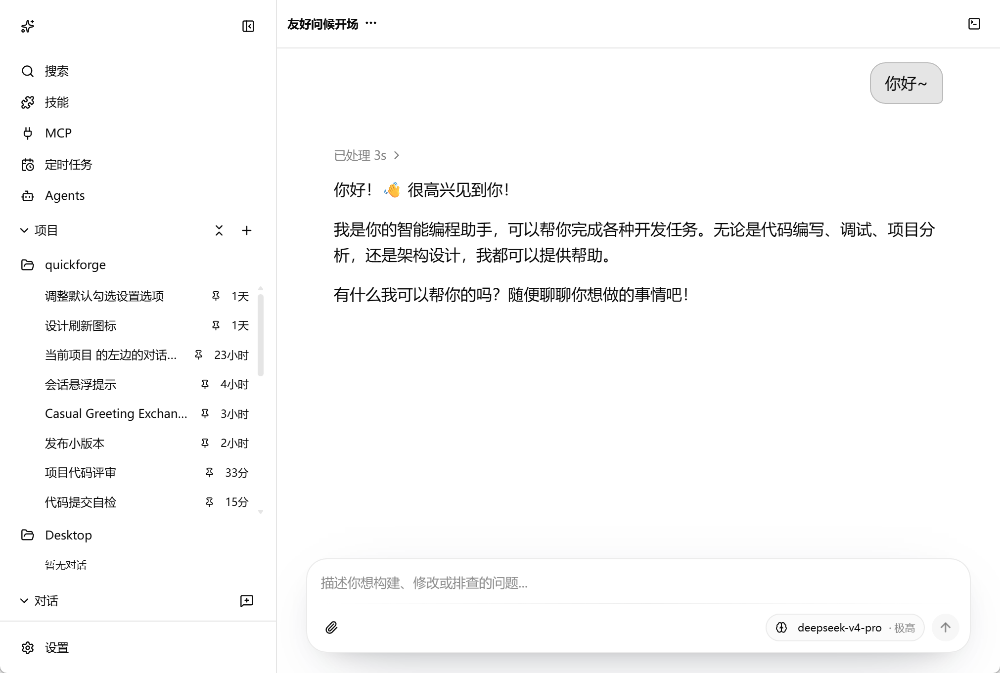
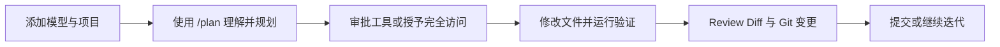

<div align="center">
  

# 速构 QuickForge

### 让 AI 在你的项目里工作，而不只是停留在聊天框里

**本地优先 · 模型自选 · 权限可控的 AI 工程工作台**

QuickForge 将 AI 对话、项目上下文、本地工具、代码审查、Git、终端与自动化工作流整合在一个本地应用中。先理解项目，再制定计划；每一次文件修改和命令执行，都由你决定如何授权。

[下载桌面版](https://github.com/shawnstack/quickforge/releases/latest) · [npm 安装](#快速开始) · [核心能力](#核心能力) · [更新记录](./CHANGELOG.md)

[](https://www.npmjs.com/package/@shawnstack/quickforge)
[](https://www.npmjs.com/package/@shawnstack/quickforge)
[](https://github.com/shawnstack/quickforge/releases/latest)
[](https://nodejs.org/)
[](./LICENSE)

</div>

<p align="center">
  
</p>

---

## QuickForge 能为你做什么？

把一个本地项目交给 QuickForge，你可以直接用自然语言完成从理解到交付的工程流程：

- **快速理解陌生项目**：阅读目录、搜索调用链、解释模块职责、梳理运行方式与风险。
- **规划后再动手**：使用 `/plan` 进行只读调研，先确认方案，再开始修改。
- **完成真实代码任务**：在工作区内读取、搜索、创建和精确编辑文件，并运行 lint、test、build 等命令。
- **随时检查改动**：在应用内查看文件、Markdown、Mermaid、HTML/SVG/图片预览、Git Diff 和工作区变更。
- **沉淀可复用流程**：通过 Agent Profiles、Subagent、Skills 和自定义命令复用团队规范与操作步骤。
- **连接更多能力**：使用 MCP、插件、ACP 和定时任务，把 AI 接入外部工具与自动化流程。



## 为什么选择 QuickForge？

<table>
<tr>
<td width="50%" valign="top">

### 🔌 你的模型，你来选择

QuickForge 不绑定单一模型厂商。你可以连接 OpenAI-compatible 或 Anthropic Messages API，以及 LiteLLM、OpenRouter、DeepSeek、Qwen、Ollama 等兼容服务。

</td>
<td width="50%" valign="top">

### 🛡️ 默认安全，按需授权

默认权限下，读取和搜索可直接执行；写文件、运行命令、调用 MCP/插件等可能改变状态的操作会请求确认。需要连续执行时，也可以主动授予完全访问权限。

</td>
</tr>
<tr>
<td width="50%" valign="top">

### 🧩 对话与工程工作区一体化

聊天、文件阅读、代码预览、工具过程、Review、Git 和终端集中在同一界面。不必在多个应用之间反复复制上下文和执行结果。

</td>
<td width="50%" valign="top">

### 💻 本地优先，不需要 QuickForge 账号

会话、项目、模型配置、记忆、缓存和日志默认保存在你的电脑中。模型请求发送到你自己配置的服务商，QuickForge 负责本地界面、存储和工具编排。

</td>
</tr>
</table>

## 快速开始

### 方式一：下载桌面版

前往 [GitHub Releases](https://github.com/shawnstack/quickforge/releases/latest) 查看可用的 Windows、macOS 和 Linux 安装包。

桌面应用内置 QuickForge 运行时，日常使用无需额外安装全局 `qf` 命令。MCP Server、外部编辑器等扩展能力仍可能依赖相应的本地程序。

### 方式二：通过 npm 安装

需要 [Node.js 22.19+](https://nodejs.org/) 和 npm：

```bash
npm install -g @shawnstack/quickforge@latest
qf
```

`qf` 会启动本地服务并自动打开浏览器。常用命令：

```bash
qf status          # 查看运行状态
qf logs            # 查看日志
qf restart         # 重启服务
qf stop            # 停止服务
qf check-update    # 检查更新
qf update          # 更新到新版本
```

### 配置你的第一个模型

QuickForge 不内置默认模型。首次打开后，点击 **添加模型**，填写 Provider、API 地址、模型 ID 和 API Key 即可开始。

以 OpenAI-compatible 服务为例：

```text
Provider name: OpenRouter / DeepSeek / LiteLLM / Ollama
Protocol type: OpenAI Compatible
Base URL:       服务商提供的 API 地址，通常以 /v1 结尾
Model ID:       服务商提供的模型 ID
API Key:        本地模型或部分代理服务可留空
```

> API Key 和模型配置保存在本机。请勿提交或分享 `~/.quickforge/` 目录中的敏感配置。

### 第一次使用建议

1. 添加一个模型。
2. 新建普通对话，或添加一个本地项目。
3. 先输入：

   ```text
   /plan 阅读这个项目，说明项目结构、运行方式和主要风险。先不要修改文件。
   ```

4. 确认计划后，让 Agent 完成一个小改动。
5. 在 **Review** 中检查 Diff，并运行项目的 lint、test 或 build。
6. 确认无误后提交，或继续让 Agent 调整。

## 核心能力

### AI 对话与上下文管理

- 流式回复、停止生成、复制、回滚、重试与对话分支
- 草稿恢复、会话置顶、归档、搜索和长对话压缩
- 图片附件与视觉模型配置
- `/init`、`/plan`、`/review`、`/summary`、`/compact`、`/help` 等内置命令；`/init` 会调研当前仓库并生成或更新根目录 `AGENTS.md` 贡献者指南
- 跨对话、跨项目的全局记忆，可在设置中查看、编辑或关闭

### 项目与本地工具

- 普通对话使用默认本地工作区，项目对话绑定你选择的目录
- 读取文件、搜索代码、创建文件、精确编辑与命令执行
- 文件路径限制在当前工作区内，并阻止访问 `.env`、私钥、凭据文件和 `.git/` 等敏感路径
- 命令输出回传对话，运行中的命令可终止
- 在资源管理器、VS Code 或 IntelliJ IDEA 中打开项目和文件

### Review、Git 与终端

- 工作区变更汇总与单文件 Diff
- 暂存、取消暂存、还原、提交与推送
- 分支查看、搜索、创建、切换与 Git 图谱
- AI 生成并编辑提交信息
- 多标签文件阅读与预览
- 集成终端（可用性取决于运行方式和本地环境）

### Agent 工作流

- 内置 `explore` 与 `general` Agent Profiles
- 自定义 Agent 的系统提示词、模型、思考等级、工具白名单和运行预算
- 将边界清晰的任务委托给 Subagent
- 加载 Claude、opencode、共享目录及 QuickForge 格式的 Skills
- 用户级、项目级和插件级自定义命令

### 扩展与自动化

- MCP：支持 stdio、SSE 和 Streamable HTTP
- 本地插件：扩展 Tools、Skills 与 Commands
- ACP：通过 `qf acp` 接入兼容 IDE 或客户端
- 定时任务：一次性、每日、每周、每月、固定间隔和 cron
- 对话分享：只读或可操作链接、密码、有效期和撤销
- 设置备份与恢复：按配置区域选择导出或导入

## 权限、安全与隐私

QuickForge 可以操作本地文件并运行命令，因此请在使用前了解边界：

| 机制 | 行为 |
|---|---|
| 默认权限 | 安全读取和搜索自动执行；写入、命令、MCP、插件等操作请求确认 |
| 完全访问权限 | 在当前工作区和敏感路径保护范围内自动执行工具，适合可信项目与可信模型 |
| 工作区限制 | 文件工具不能访问当前工作区之外的路径，并校验符号链接的真实位置 |
| 敏感文件保护 | 默认阻止 `.env`、私钥、证书、凭据文件和 `.git/` 等路径 |
| Shell 命令 | 以当前操作系统用户权限运行，**不是系统级沙箱** |
| 本地数据 | 默认存储在 `~/.quickforge/`；模型请求会发送到你配置的模型服务商 |

建议在重要项目中：

- 先提交 Git 或创建备份，再授权 AI 修改文件。
- 默认使用 `/plan` 调研复杂任务，不要直接要求大范围改动。
- 只在可信模型、可信项目中使用完全访问权限。
- 配置局域网完整访问或可操作分享时，使用强密码并控制网络范围。

更多说明请查看 [安全策略](./SECURITY.md)。

## 支持的运行方式

| 方式 | 适合谁 | 说明 |
|---|---|---|
| Desktop | 希望开箱即用的用户 | Windows / macOS / Linux 桌面入口，内置运行时 |
| npm CLI | 开发者与高级用户 | `npm install -g @shawnstack/quickforge@latest`，需要 Node.js 22.19+ |
| Node.js SDK | 需要嵌入本地服务的应用 | 通过 `startQuickForge()` 启动 QuickForge |
| ACP Agent | IDE 与 Agent 客户端集成 | 使用 `qf acp` 暴露 stdio ACP Agent |

<details>
<summary><strong>Node.js SDK 示例</strong></summary>

```js
import { startQuickForge } from '@shawnstack/quickforge'

const app = await startQuickForge({
  host: '127.0.0.1',
  port: 5176,
})

console.log(app.url)
```

</details>

## 数据存储

默认数据目录为 `~/.quickforge/`，Windows 通常对应 `%USERPROFILE%\.quickforge`：

```text
~/.quickforge/
├── config/       # 应用、模型、MCP、插件和项目等配置
├── storage/      # 会话、索引、分享等持久化数据
├── cache/        # 可重新生成的缓存
├── agents/       # 用户 Agent Profiles
├── workspace/    # 普通对话的默认工作区
├── MEMORY.md     # 可选的全局记忆
└── logs/         # 本地日志
```

其中可能包含 API Key、项目路径、对话内容和命令日志，请勿公开分享整个数据目录。

## 文档与帮助

- [中文使用教程](./docs/user-guide.zh-CN.md)
- [English User Guide](./docs/user-guide.en-US.md)
- [更新记录](./CHANGELOG.md)
- [项目 Wiki](./docs/wiki/README.md)
- [安全策略](./SECURITY.md)
- [贡献指南](./CONTRIBUTING.md)
- [GitHub Releases](https://github.com/shawnstack/quickforge/releases/latest)
- [问题反馈](https://github.com/shawnstack/quickforge/issues)

## 本地开发

```bash
git clone https://github.com/shawnstack/quickforge.git
cd quickforge
npm ci
npm run dev
```

提交改动前建议运行：

```bash
npm run lint
npm run test
npm run build
```

架构和模块导航请查看 [代码 Wiki](./docs/wiki/README.md)，贡献要求请查看 [CONTRIBUTING.md](./CONTRIBUTING.md)。

## License

QuickForge 基于 [MIT License](./LICENSE) 开源。

---

<div align="center">

如果 QuickForge 对你有帮助，欢迎点一个 **Star**。<br />
你的反馈、Issue 和贡献，会帮助它成为更好用的本地 AI 工程工作台。

</div>
