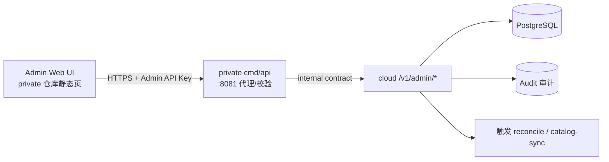

# QuickForge Cloud 管理后台 — 规划与工作接手文档

> 本文件是管理后台的规划与历史接手入口。状态判断必须区分“当前 `quickforge` 仓库已验证”和“外部仓库文档声明但本次未验证”，不得把外部记录写成当前仓库的验证结论。
> 最后更新：2026-08-05（`quickforge` 文档一致性核对）

## 0. 接手速览（30 秒版）

- **目标**：为 QuickForge Cloud 建设运营管理后台（企业级），让运营/管理员通过 Web 界面管理安装实例、额度、模型目录、审计，而不是直接改数据库。
- **当前 `quickforge` 仓库已实现并验证**：本地 Node BFF 的 Cloud 配置、health/ready 连接测试、身份重建、Session URL 绑定、状态读取，以及本机/Tailscale IPv4 访问边界；详见 `docs/architecture/quickforge-cloud-client.zh-CN.md`。
- **外部仓库文档声明、未验证**：后文历史记录声称社区版管理端点、OpenAPI 管理契约和 private 管理 UI 已完成；本次没有读取、构建、测试或部署这些仓库，因此只能保留为外部声明，不能写成已由本任务验证。
- **Planned**：P1 用量报表、目录编辑、告警和正式账户管理等后续功能。
- **Not in current scope**：本任务不验证或实现 Cloud 服务端、Provider、支付、生产部署、基础设施、真实 Tailnet 或 Android E2E。
- **Blocked / NO-GO**：外部文档当前仍把 Cloud Beta 标为 NO-GO；在真实 Provider 与生产基础设施验收完成前，不得宣称生产可用。
- **相关仓库（仅 `quickforge` 在本次验证范围内）**：
  | 仓库 | 路径 | 职责 | 本次状态 |
  |---|---|---|---|
  | quickforge | `D:\quickforge`（当前工作区） | 本地客户端 + Node BFF | 已核对源码和相关测试 |
  | quickforge-cloud | `D:\quickforge-cloud` | 云端核心服务（Go） | 外部文档来源，本次未验证 |
  | quickforge-cloud-api | `D:\quickforge-cloud-api` | OpenAPI 协议规范 | 外部文档来源，本次未验证 |
  | quickforge-cloud-private | `D:\quickforge-cloud-private` | 官方运营扩展（商业） | 外部文档来源，本次未验证 |

## 1. 状态盘点

### 1.1 当前 quickforge 仓库——已实现并验证

- 本地 Node BFF 已实现并挂载以下能力：
  - `GET /api/cloud/config`
  - `PUT /api/cloud/config`
  - `POST /api/cloud/test-connection`
  - `POST /api/cloud/identity/reset`
  - `GET /api/cloud/status`
- 新 Session 会绑定规范化 `sessionCloudUrl`。存在 Refresh Token 时，跨 URL 保存配置返回 HTTP 409 / `cloud_session_active`；Token 操作遇到 URL 不匹配或旧 Session 缺失 URL 绑定时返回 HTTP 409 / `cloud_session_service_mismatch`，并在发送旧 Refresh Token 前拒绝。
- Identity reset 只清理本地 Session、内存 Access Token/模型缓存并轮换 installation，不联系旧或新 Cloud 服务。
- `/api/cloud/*` 仅允许本机，或“已通过 LAN 密码认证且 socket 来源属于 Tailscale IPv4 `100.64.0.0/10`”的客户端。普通 LAN、公网来源、未认证请求和 Tailscale IPv6 当前均拒绝；未认证远端请求可能先由全局 LAN 层返回 401，到达 Cloud 路由但不满足边界时返回 403 / `cloud_local_only`。
- 本次执行的相关测试：9 个文件、58 个测试通过；覆盖配置、路由、身份、Session URL 绑定、旧 Session 拒绝、身份 reset、远程边界、Chat 幂等 sidecar 和前端同源客户端。该结论只适用于当前工作区快照，不代表已提交或已发布版本。

### 1.2 外部仓库文档声明——本次未验证

以下内容来自本文原有历史记录或外部仓库路径，本次没有读取其源码、运行其测试或验证其部署：

- `quickforge-cloud` 的数据模型、公开端点、额度、网关、管理端点和生产预验收记录；
- `quickforge-cloud-api` 的 OpenAPI 0.2.x 管理契约；
- `quickforge-cloud-private` 的 Admin API 代理、会话/CSRF、六页面管理 UI 和 E2E 记录；
- 任何真实 Provider、PostgreSQL/Redis 生产实例、支付供应商、TLS/反向代理、备份恢复和生产基础设施状态。

因此，后文涉及这些仓库的“完成”“通过”“已修复”均应理解为**外部文档声明、未由本次 quickforge 核对验证**。

### 1.3 统一状态矩阵

| 能力 | 当前状态 | 本次证据范围 |
|---|---|---|
| quickforge 本地 Cloud BFF、配置、连接测试、身份重建、Session URL 绑定 | ✅ 已实现并验证 | 当前仓库源码 + 58 个相关测试 |
| quickforge 前端账户与云服务页、同源 Cloud 客户端、模型目录缓存失效 | ✅ 已实现并验证 | 当前仓库源码 + 前端相关测试 |
| 社区版 Cloud 管理端点与 OpenAPI 管理契约 | ⚠️ 外部仓库声明已完成，本次未验证 | 仅本文历史记录 |
| private 运营管理后台 MVP | ⚠️ 外部仓库声明已完成，本次未验证 | 仅本文历史记录 |
| P1 用量报表、目录编辑、告警、正式账户管理 | 🗓️ Planned | 规划项 |
| 支付、发票、企业路由、完整风控 | ➖ Not in current scope | 不属于本次 quickforge 文档收口 |
| Cloud Beta 生产可用 | ⛔ Blocked / NO-GO | 外部记录称真实 Provider 与生产基础设施验收未完成；本次未复验 |

## 2. 管理后台功能规划（历史设计基线）

> 本节及第 3 节描述目标设计，不表示当前实现状态。外部仓库是否已经实现这些项目，只能按第 1 节记为“外部声明、未验证”。

### 2.1 功能清单

| # | 模块 | 功能 | 优先级 | 依赖 |
|---|---|---|---|---|
| 1 | 仪表盘 | 用量趋势、安装数/活跃数、额度消耗、异常计数（replay、stale reservation、5xx） | P0 | 只读 PG + /metrics |
| 2 | 安装实例 | 列表（fingerprint、账户、状态、设备）、详情、远程撤销、封禁/解封 | P0 | `installations`、`refresh_sessions` |
| 3 | 额度管理 | 查看 entitlement（类型/额度/周期）、手动 grant/revoke credits（写操作 + 审计） | P0 | `entitlements`、`quota_ledger` |
| 4 | 模型目录 | 列表、启用/禁用、查看路由优先级；触发 catalog-sync 重跑 | P0 | `model_catalog`、`model_routes` |
| 5 | 审计日志 | admin 操作查询（谁在何时对什么做了什么） | P0 | `internal/admin`（AuditRecorder） |
| 6 | 用量明细 | 按账户/模型/时间的 usage 查询与导出（CSV） | P1 | `usage_events`、`quota_ledger` |
| 7 | 目录编辑 | 模型增删改、价格/credits 配置、路由优先级调整 | P1 | catalog-sync |
| 8 | 告警 | 规则配置 + 通知（finalize failure、reservation 卡住、replay 风暴） | P1 | /metrics + 事件表 |
| 9 | 账户管理 | 游客/正式账户列表、封禁、合并（依赖 Device Flow） | P1 | `accounts` |
| 10 | 计费 | 支付对接、账单、发票（billing 骨架填实） | P2 | 支付供应商 Webhook |
| 11 | 风控 | 滥用检测规则（新安装风暴、异常用量、多设备） | P2 | risk 骨架 |
| 12 | 企业路由 | 企业客户专属模型路由、failover 策略 | P2 | routing 骨架 |
| 13 | RBAC | 多管理员、角色权限 | P2 | admin 模块 |
| 14 | 备份/恢复 UI | 一键备份、恢复演练 | P2 | 社区版 P0 缺口 |

### 2.2 分期

- **MVP（P0，本次最小设计）**：#1~#5。
- **下一期（P1）**：#6~#9。
- **商用期（P2）**：#10~#14。

## 3. 最小设计（MVP）

### 3.1 架构原则（沿用现有边界）

- 社区版保持「无需运营后台也能自托管」：后台是可选组件，放在 `quickforge-cloud-private`。
- 社区版新增一组受保护的**管理端点** `/v1/admin/*`（内部契约，文档化进 `quickforge-cloud-api`），private 后台通过它们读写；禁止直接连社区版 PG 或 import Go 包。
- 所有 admin 写操作必须落审计（AuditRecorder 骨架填实）。

### 3.2 组件与流程



- **Admin Web UI**：纯静态页（原生 JS 或轻量框架，不引入重型前端依赖），部署在 private 仓库；登录方式：Admin API Key 输入 + 会话。
- **private cmd/api**：负责 UI 静态托管 + 转发到社区版 `/v1/admin/*`，可在此层做请求签名/来源校验。
- **社区版 `/v1/admin/*`**：新增在 `cmd/api` 中，独立于客户端路由；用独立的 Admin API Key 认证（环境变量注入，支持多 key 轮换），不用客户端 JWT 体系。

### 3.3 管理 API 历史草案

> 外部记录称该草案后来已写入 `quickforge-cloud-api`，但本次未验证实际 OpenAPI 内容。

```
GET    /v1/admin/dashboard            # 仪表盘聚合（只读）
GET    /v1/admin/installations        # 安装实例列表（分页/筛选）
GET    /v1/admin/installations/{id}   # 实例详情
POST   /v1/admin/installations/{id}/revoke   # 远程撤销（写+审计）
POST   /v1/admin/installations/{id}/ban      # 封禁（写+审计）
GET    /v1/admin/entitlements?accountId=     # 额度查询
POST   /v1/admin/entitlements/grant          # 授予额度（写+审计）
POST   /v1/admin/entitlements/revoke         # 撤销额度（写+审计）
GET    /v1/admin/models               # 模型目录列表（含 enabled/route）
POST   /v1/admin/models/{id}/toggle   # 启用/禁用（写+审计）
POST   /v1/admin/catalog/sync         # 触发目录同步（写+审计）
GET    /v1/admin/audit?actor=&action= # 审计日志查询
```

### 3.4 数据依赖（11 表）

- 读：`accounts`、`installations`、`refresh_sessions`（异常）、`entitlements`、`model_catalog`、`model_routes`、`usage_events`、`quota_ledger`。
- 写：`entitlements`（grant/revoke，写 `quota_ledger` 记账）、`installations`（revoke/ban 状态）、`model_catalog`（enabled）。
- 审计：新表 `admin_audit_log`（或 private 侧独立存储）——建议新迁移 `000002_admin.up.sql`。

### 3.5 安全要求

- Admin API Key：独立于客户端 token；文件/环境注入；支持轮换；泄露可单独吊销。
- CORS 仅允许 admin UI 来源；管理端点永不返回 refresh token、上游 credential、idempotency 原始响应。
- 所有写操作记录 `AuditEvent{ActorID, Action, TargetID, Metadata}`。
- 管理端点不应暴露 `/metrics` 敏感指标细节给非管理员。

### 3.6 MVP 页面清单

1. 登录页（Admin API Key 换取安全会话）
2. 仪表盘：今日用量、安装数、活跃设备、异常计数、额度消耗 Top
3. 安装实例：列表 + 详情抽屉 + 撤销/封禁操作
4. 额度：账户额度列表 + grant/revoke 表单
5. 模型目录：模型列表 + 启用/禁用开关 + 路由优先级只读
6. 审计：操作日志列表 + 筛选

### 3.7 Web 初始技术建议

> 这是设计阶段建议。外部历史记录称 private 后台最终采用原生 HTML/CSS/ES Modules；本次未验证其实际实现。

- **推荐栈**：React + TypeScript + Vite；不引入重型组件库，复用 QuickForge 的轻量视觉原则与 CSS token 思路。
- **交付方式**：前端产出静态文件，由 `quickforge-cloud-private/cmd/api` 内嵌或托管；浏览器只连接 private API，不直接访问 community Cloud API。
- **图标**：Lucide 风格线性图标；导航保留文字，危险操作仅在确认语境中使用红色。
- **数据访问**：统一 `admin-api-client` 封装，自动带 CSRF Token、请求 ID 和错误映射；禁止组件直接拼接 API URL。
- **依赖原则**：MVP 不引入图表大库；仪表盘折线图优先 SVG 自绘，避免为一个图表增加大依赖。

### 3.8 Web 信息架构与路由

| 路由 | 页面 | 核心任务 | 设计阶段 |
|---|---|---|---|
| `/login` | 管理员登录 | Admin API Key 换取安全会话 | P0 |
| `/` | 概览 | 判断服务是否健康、是否存在待处理异常 | P0 |
| `/installations` | 安装实例 | 搜索、筛选、查看、撤销、封禁实例 | P0 |
| `/installations/:id` | 实例详情 | 查看账户、会话、用量和审计关联 | P0（桌面抽屉/移动端独立页） |
| `/entitlements` | 额度管理 | 查询额度、grant/revoke | P0 |
| `/models` | 模型目录 | 查看模型和路由、启用/禁用、触发同步 | P0 |
| `/audit` | 审计日志 | 查询管理员写操作和请求 ID | P0 |
| `/usage` | 用量分析 | 按账户/模型/时间查询与导出 | P1 |
| `/alerts` | 告警规则 | 告警条件和通知渠道 | P1 |
| `/accounts` | 正式账户 | 账户详情、封禁、合并 | P1（依赖 Device Flow） |
| `/billing` | 计费 | 账单、支付、发票 | P2 |
| `/risk` | 风控 | 规则、命中、处置 | P2 |
| `/routing` | 企业路由 | 客户专属路由和 failover | P2 |

MVP 左侧导航只出现：**概览、安装实例、额度管理、模型目录、审计日志**。未实现页面不得展示空入口。

### 3.9 页面布局与视觉规范

设计基准：沿用 `DESIGN_LANGUAGE.md` 的「轻盈、克制、一致、清晰、工具感」。Web 后台不是营销站，不使用大渐变、玻璃拟态或重卡片墙。

#### 桌面端（推荐宽度 ≥ 1024px）

- 左侧固定导航宽约 `232px`，使用浅弱背景；当前项用淡背景 + 轻微阴影，不使用粗左边线。
- 顶栏高约 `60px`：当前页标题、服务状态、刷新、管理员菜单。
- 主内容最大宽度约 `1280px`，页面左右留白 `24~32px`；数据表可占满可用宽度。
- 仪表盘指标放在一个连续容器中，用分割线分组，避免四张厚重独立卡片。
- 表格行高紧凑但不低于 `44px`；主标识使用等宽字体并提供复制按钮。
- 详情使用右侧抽屉；创建/调整额度使用居中对话框；高风险确认使用独立确认对话框。

#### 窄屏（< 1024px）

- 左侧导航折叠为顶栏抽屉；保留完整文字，不做难懂的 icon-only 导航。
- 数据表优先横向滚动；宽度小于 `640px` 时切换为主字段卡片列表。
- 桌面详情抽屉在手机端变为全屏二级页。
- 管理后台以桌面工作流为主，但登录、查看状态、紧急撤销必须在手机上可完成。

#### 颜色与状态

- 使用系统字体和 QuickForge 现有语义色：`background / foreground / muted / border / primary`。
- 正常状态以中性文字为主；成功、警告、危险色只用于状态点、徽标和确认语境。
- 危险按钮默认保持克制，仅在 hover/确认对话框中强化红色。
- 所有状态不能只靠颜色表达，必须配文字或图标。

桌面端低保真参考图：[`docs/design/cloud-admin-console-wireframe.svg`](../design/cloud-admin-console-wireframe.svg)。

### 3.10 各页面详细设计

#### A. 登录页

- 字段：Admin API Key；环境名称/目标域名只读展示。
- 流程：`POST /admin/session` 校验 key，成功后设置 `HttpOnly + Secure + SameSite=Strict` Cookie；原始 key 不写入 localStorage/sessionStorage。
- 状态：错误次数、冷却时间、服务不可达；连续失败必须限流。
- 文案明确提示当前环境（Production/Staging），防止误操作生产环境。

#### B. 概览

- 指标：今日 token、24h 活跃安装、剩余额度比例、待处理异常。
- 趋势：最近 7 天 input/output token 折线图；支持 24h/7d/30d（MVP 可先仅 7d）。
- 待关注：stale reservation、refresh replay、额度即将到期、5xx/429 异常。
- 最近操作：最近 10 条 admin 审计事件；点击进入 `/audit`。
- 必须展示数据更新时间；部分数据失败时使用局部错误，不让整页白屏。

#### C. 安装实例

- 列：安装 ID/fingerprint、账户、模式（guest/account）、状态、最近活跃、创建时间、当前 session 数。
- 筛选：关键词、状态、账户模式、创建时间；服务端分页，URL 保存筛选条件。
- 详情：基本信息、关联账户、Refresh Session、最近用量、最近审计。
- 操作：撤销当前 installation、封禁/解封；必须填写原因并二次确认。
- 成功后即时更新行状态并显示 request ID；失败保留表单内容以便重试。

#### D. 额度管理

- 列：账户、entitlement 类型、总额度、已使用、剩余、周期结束、状态。
- grant/revoke 表单：账户、credits、原因、可选到期时间；提交前展示变更预览。
- 每次写操作生成 `Idempotency-Key`，社区版在事务内写 entitlement + ledger + audit。
- 禁止直接编辑“已使用”；修正必须通过明确的 ledger 调整事件完成。

#### E. 模型目录

- 列：模型 ID、显示名、公开性、requires_account、enabled、context/max tokens、路由数、最近同步时间。
- MVP 写操作：启用/禁用、触发 catalog sync；路由详情只读。
- 禁用前展示影响：当前引用的安装/最近 24h 调用量（若 API 暂无数据则明确“未知”）。
- 上游 credential 只显示引用名称和是否配置，永不返回真实密钥。

#### F. 审计日志

- 列：时间、Actor、Action、Target、结果、Request ID。
- 筛选：时间、actor、action、target、结果；支持复制 request ID。
- 展开项显示脱敏 metadata 和变更前后摘要；不展示 refresh token、Admin API Key、上游凭据。
- 审计日志默认不可删除；保留期作为 P1 运维策略确定。

### 3.11 通用组件与交互状态

- `AppShell`、`SidebarNav`、`TopBar`、`EnvironmentBadge`
- `DataTable`、`FilterBar`、`Pagination`、`StatusBadge`、`CopyableId`
- `DetailDrawer`、`FormDialog`、`DangerConfirmDialog`
- `LoadingSkeleton`、`EmptyState`、`InlineError`、`Toast`
- `RequestIdLink`：每次写操作都能从 UI 定位到审计/服务端日志

统一状态要求：

1. **Loading**：使用骨架或行占位，避免全屏转圈。
2. **Empty**：说明“为什么为空”和可执行下一步，不做厚重空卡片。
3. **Error**：保留筛选/表单内容，提供重试和 request ID。
4. **Permission denied**：说明缺少的权限，不伪装成 404。
5. **Stale data**：超过刷新周期时标记数据时间，写操作前重新校验关键实体版本。
6. **Optimistic UI**：仅用于低风险 toggle；额度、封禁、撤销必须等待服务端事务成功。

### 3.12 Web 安全与权限细化

MVP 暂时只有单一 `superadmin`，但接口和审计模型必须预留 `actor_id`、`role`：

- 浏览器提交 API Key 后仅得到短期 HttpOnly 会话；服务端保存 key 校验结果，不把原始 key返回浏览器。
- 写请求必须携带 CSRF Token；会话默认 30~60 分钟无操作过期。
- 登录、grant/revoke、ban/revoke installation 设置独立速率限制。
- 高风险接口要求 `reason`、`Idempotency-Key` 和实体版本号（防并发覆盖）。
- P1 接入 OIDC/SSO 后扩展为 `viewer / operator / superadmin`：viewer 只读，operator 可处理实例和目录，superadmin 可调额度和权限。

### 3.13 MVP 设计验收标准（本次未验证）

> 以下复选框是设计级验收要求，不是当前进度 Checklist。本次未验证外部管理后台，因此保持未勾选。

- [ ] 六个 MVP 页面可通过真实或 mock API 完整加载；导航和深链接可刷新恢复。
- [ ] 1280px 桌面、1024px 窄屏、390px 手机下无关键内容不可达。
- [ ] 原始 Admin API Key、客户端 token、上游凭据均不进入浏览器存储、日志或错误正文。
- [ ] 撤销/封禁/额度调整/模型切换全部有原因、确认、幂等和审计记录。
- [ ] 每次写操作成功或失败均展示 request ID，可在审计页搜索。
- [ ] 列表支持服务端分页、筛选和 URL 状态恢复。
- [ ] Loading/Empty/Error/Permission/Stale 五类状态有明确设计和实现。
- [ ] 键盘可完成导航、筛选、打开/关闭对话框；焦点可见，图标按钮具备可访问名称。
- [ ] 页面符合 QuickForge 轻量设计语言：弱边框、统一分割线、克制阴影、无重卡片墙。

## 4. 历史工作记录（外部声明需单独看待）

> 状态图例：`✅ quickforge 已验证` 表示本次可由当前仓库源码/测试确认；`⚠️ 外部声明，未验证` 表示仅保留历史记录，未检查对应外部仓库；`🗓️ Planned` 表示规划项；`⛔ NO-GO` 表示不能进入生产。

| 日期 | 事项 | 状态 |
|---|---|---|
| 2026-08-04 | 调研四仓库：当时记录云端用户侧已实现、后台未做、private 仅骨架 | ⚠️ 历史外部调研，本次未复验 |
| 2026-08-04 | 验证 quickforge 客户端侧：当时记录 `npm run test` 758 过 / lint 过 / build 过 | ⚠️ 历史记录；本次改为相关 58 测试通过 |
| 2026-08-04 | 梳理数据模型（11 表）、公开端点（12 个）、运维面（metrics/reconcile/catalog） | ⚠️ 外部声明，未验证 |
| 2026-08-04 | 本文件：功能规划 + 最小设计 + 接手入口 | ✅ 文档记录 |
| 2026-08-04 | 补充 Web 管理后台详细设计：技术栈、路由、响应式布局、六个页面、交互状态、安全与验收标准 | ✅ 文档设计完成，不代表实现验收 |
| 2026-08-04 | 生成桌面端低保真图 `docs/design/cloud-admin-console-wireframe.svg` | ✅ 当前仓库文件 |
| 2026-08-04 | E2E 联调（临时实例 5199 + 云端 8080 + mock 上游 18080）：游客注册、云模型目录、额度扣减、Agent 云调用主链路全部打通 | ⚠️ 外部/历史执行声明，本次未复验 |
| 2026-08-04 | E2E 发现 usage 相关问题（见 §5.4） | ⚠️ 历史记录 |
| 2026-08-05 | usage bug 修复及 E2E 复验 | ⚠️ 外部/历史执行声明；当前 quickforge 源码含对应零成本表与测试，但本次未复验跨仓 E2E |
| 2026-08-05 | 社区版管理端点完成 | ⚠️ 外部仓库声明，未验证 |
| 2026-08-05 | 管理端点契约完成 | ⚠️ 外部仓库声明，未验证 |
| 2026-08-05 | private 管理后台完成 | ⚠️ 外部仓库声明，未验证 |
| 2026-08-05 | Cloud Beta 第一轮生产预验收发现 P0 阻断风险 | ⛔ 外部记录为 NO-GO，本次未复验 |
| 2026-08-05 | 外部记录称额度安全 P0 已修复，但真实 Provider 与生产基础设施验收未完成 | ⛔ 仍为 NO-GO；外部声明，未验证 |

## 5. 风险清单（持续更新）

### 5.1 云端服务端风险（来自外部文档，本次未验证）

- **当前门禁：NO-GO**。外部记录称额度安全 P0 已关闭，但真实 Provider 与生产基础设施验收仍未完成；本次未读取或复验对应仓库，不能提升状态。
- 单 JWT active signing key、单 AES 加密 key，无 keyring 轮换能力；密钥切换只能等旧记录过期，且当前无 cleanup 任务。
- `entitlements` 为游客 30 天一次性额度，无自动续期/停止逻辑（Open question）。
- 备份恢复流程未实际演练（RPO/RTO 未定义，P0）。
- `idempotency_requests` 有 `expires_at` 但无 cleanup worker；旧 token/session 无清理。
- replay 检测依赖客户端升级版本后才能正确处理（旧客户端直接崩溃）。
- `installations.public_key_fingerprint` 全局唯一 → 退出后重注册同密钥会撞唯一约束（客户端已轮换密钥规避，但风险仍在文档中标注）。
- 安装私钥未用于 Proof-of-Possession。

### 5.2 后台建设新增风险

- Admin API Key 泄露影响面大 → 必须审计 + 可吊销 + 最小权限。
- 管理写操作（grant/revoke/ban）若不加审计或并发控制，可能造成额度错账 → grant/revoke 必须走 `quota_ledger` 记账 + 幂等。
- 静态 Admin UI 若无独立认证，等于把后台暴露公网 → 登录态 + CORS + 内网/网关限制。
- private 仓库是 Proprietary 闭源，社区版不能反向依赖它；契约必须先落 `quickforge-cloud-api` 再实现。

### 5.3 当前 quickforge 工作区说明

- 当前工作区存在并行 Agent 的未提交修改和未知文件；本任务只修改指定文档，不处理、删除或评价 `.qf-provider-*.tmp`、`NOT`、`artifacts` 等未知文件。
- 本次验证结论针对当前工作区快照，不代表某个 Git commit、tag、发布包或 npm 已发布版本。

### 5.4 历史跨仓 E2E 记录（本次未复验）

- 本节保留原有历史调查与修复记录，不构成本次对外部 Cloud 服务、Provider 或部署的验证。

- **历史记录称已修复/已提交，本次未复验**：云端与分享改动曾记录为分别提交（`187258a`、`35053de`），并称垃圾文件 `0)`、`nul` 已清理。
- **历史记录称已修复（2026-08-05），本次未复验跨仓 E2E**：云端 gateway 返回 OpenAI 风格 usage（`prompt_tokens`/`completion_tokens`/`total_tokens`），而客户端 BFF 解析时按 pi-ai 结构读取 `usage.input`，抛 `Cannot read properties of undefined (reading 'input')`。记录中的现象为：模型回复文本已正常返回、云端已扣减额度（used +20），但客户端会话收尾 `stopReason:"error"`，assistant 消息 usage 全为 0。
  - **根因**：pi-ai 的 `calculateCost()`（`node_modules/@earendil-works/pi-ai/dist/models.js`）无条件读取 `model.cost.input`，而云模型目录不含价格字段 → `model.cost` 为 `undefined` 时抛错。与 usage 字段解析本身无关。
  - **修复**：`server/cloud/runtime.mjs` 的 `resolveManagedCloudProvider()` 为云模型补 `cost: { input:0, output:0, cacheRead:0, cacheWrite:0 }`（云端按 credits 记账，本地成本显示 0）；新增 `setCloudRuntimeForTests()` 测试注入钩子 + `tests/server/cloud/runtime.test.mjs`（2 个防回归用例）。
  - **历史验证声明**：曾记录单测 19 个通过，且跨仓 E2E 复验 `state.status=idle`、`errorMessage` 为空、usage 正确解析（input:12/output:8/totalTokens:20）；本次只确认当前 quickforge 相关源码/测试状态，不确认该跨仓 E2E。

### 5.5 社区版管理端点历史记录（外部声明，未验证）

- **新增文件（quickforge-cloud）**：`migrations/000002_admin.{up,down}.sql`、`internal/admin/{service,audit}.go`、`internal/httpapi/admin.go`（12 端点 + adminAuth + adminCORS）、`internal/catalog/sync.go`（catalog-sync 逻辑提取复用）、`internal/config/config.go` 扩展（`QF_CLOUD_ADMIN_KEYS[_FILE]`、`QF_CLOUD_ADMIN_CATALOG_FILE`、`QF_CLOUD_ADMIN_CORS_ORIGINS`）。
- **端点**：dashboard / installations(list|detail|revoke|ban) / entitlements(list|grant|revoke) / models(list|toggle) / catalog/sync / audit —— 与 §3.3 草案一致。
- **认证**：独立 Admin API Key（Bearer，constant-time 比较，支持多 key 轮换）；审计 actor 为 key 指纹（`key:<sha256 前 8 字节>`），不落明文密钥；未配置 key 时端点返回 503 `admin_not_configured`。
- **审计**：写操作（revoke/ban/grant/revoke-entitlement/toggle/sync）全部落 `admin_audit_log`，含 actor/action/target/metadata/requestId/outcome。
- **安全约束实现**：CORS 仅放行配置 origin（默认同源）；端点永不返回 refresh token/上游凭据/幂等原始响应。
- **外部记录的验证声明（本次未复验）**：`go build`/`go vet`、`go test ./...`、本地 PG 集成测试和管理端点 E2E 曾被记录为通过；本任务不能确认当前外部仓库仍保持该状态。
- **遗留/说明**：`ban` 当前 = 撤销会话 + `banned_at` 标记，注册侧按 fingerprint 拦截属 P1 风控；`catalog/sync` 直接读取 `QF_CLOUD_ADMIN_CATALOG_FILE` 并复用 catalog-sync 的校验/upsert 逻辑（api 进程的 credential 名集合作为允许列表）；`ListEntitlements` 只返回未过期额度（revoke 即 `period_end=now()`，纯 DB 时钟，无 Go/DB 时钟竞态）。

### 5.6 Private 管理后台历史记录（外部声明，未验证）

- **后端（quickforge-cloud-private）**：`internal/admin` 新增配置、并发安全内存 session、登录限流、CSRF、12 路由精确白名单代理、上游 Bearer 注入、响应状态/JSON/`X-Request-ID`/`Retry-After` 透传、401 自动清会话、稳定错误响应及安全中间件；`cmd/api` 完成环境装配、HTTP timeout 和优雅停机。
- **凭据边界**：Admin Key 仅在 private 进程 session 内存；浏览器只持有 HttpOnly + SameSite=Strict Cookie 与内存 CSRF token；浏览器提交的 Authorization/Cookie/CSRF 不转发上游；生产默认 Secure Cookie，本地 HTTP 联调需显式 `QF_CLOUD_PRIVATE_DEVELOPMENT=true`。
- **审计**：private 的 `SlogAuditRecorder` 记录 login success/failure、logout、session expired、CSRF/proxy denied/error，禁止记录 Admin Key/Authorization/Cookie/CSRF/请求正文；业务写操作的权威审计仍由社区版 `admin_audit_log` 承担。
- **UI**：原生 HTML/CSS/ES Modules + `go:embed web/*`，无 npm/第三方依赖；实现登录、概览、安装实例、额度管理、模型目录、审计日志六页面，包含筛选/分页/详情抽屉/写操作确认/提交禁用/request ID 展示/401 回登录，以及 1024/640 响应式布局。
- **外部记录的 E2E 声明（本次未复验）**：曾记录 community 临时 `127.0.0.1:8082` + private `127.0.0.1:8081` 的 UI、登录、会话恢复、dashboard、模型 toggle、审计和 logout 流程通过；本任务不能确认当前外部仓库或部署仍保持该状态。
- **已知限制**：session 和登录限流为单进程内存态（重启失效，多实例需共享存储或 sticky session）；grant 无 Admin 幂等语义，UI 不自动重试；写请求缺 reason/实体版本；列表无 total；audit 暂不支持 requestId/time/target 查询；ban 尚未完整拦截重新注册；dashboard 无按日趋势数据，UI 未伪造。

## 6. 当前 Checklist

- [x] **quickforge 本地 BFF 已核对**：配置读取/保存、连接测试、状态、身份 reset 与 runtime 失效行为均有当前源码和相关测试支撑。
- [x] **Session URL 安全语义已核对**：新 Session 持久化 `sessionCloudUrl`；跨 URL 保存使用 `cloud_session_active`；Token 操作遇到不匹配或旧 Session 使用 `cloud_session_service_mismatch`，并在发送旧 Refresh Token 前拒绝。
- [x] **本机/Tailscale 边界已核对**：允许本机，或已通过 LAN 密码认证且来源为 Tailscale IPv4 `100.64.0.0/10` 的客户端；其他来源拒绝。真实 Tailnet/ACL/IPv6/Android E2E 未验证。
- [x] **当前仓库相关测试已执行**：9 个测试文件、58 个测试通过。
- [x] **指定架构文档与代码 Wiki 已同步**：统一使用“当前仓库已验证 / 外部声明未验证 / Planned / Not in current scope / Blocked/NO-GO”口径。
- [ ] **外部社区版管理端点、OpenAPI 契约和 private 后台复验**：Not in current scope；不能因历史记录中的 `[x]` 或“通过”字样视为本次已验证。
- [ ] **P1 功能**：Planned（用量报表、目录编辑、告警、正式账户管理）。
- [ ] **生产放行**：Blocked / NO-GO；真实 Provider 与生产基础设施验收未完成，且本次未验证支付或生产部署。

## 7. 相关文档索引

- 云端客户端侧设计：`docs/architecture/quickforge-cloud-client.zh-CN.md`（quickforge 仓库）
- 云端总体/生产验收：`D:\quickforge-cloud\docs\README.md`、`production-acceptance.md`
- 数据模型：`D:\quickforge-cloud\docs\data-model.md`
- 运维手册：`D:\quickforge-cloud\docs\operations-runbook.md`
- 产品需求：`D:\quickforge-cloud\docs\product-requirements.md`
- 协议契约：`D:\quickforge-cloud-api\openapi\openapi.yaml`
- 商业扩展边界：`D:\quickforge-cloud-private\docs\integration-boundary.md`
