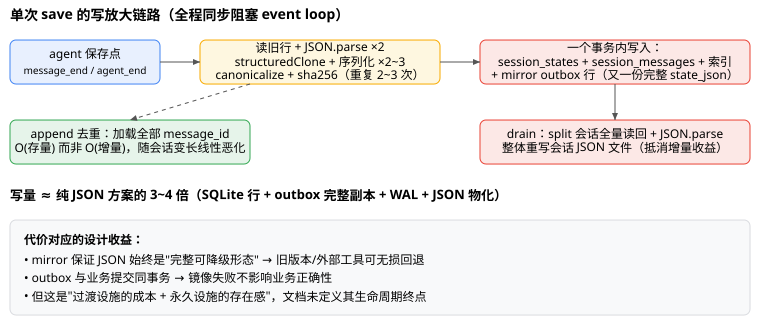

# 对话记录迁移 SQLite 整体设计评审报告

> 评审对象：会话记录（conversation/session state）从 JSON 文件迁移到 SQLite 权威存储的整体设计（F1–F9，已完成实现）。
> 评审方式：设计文档评审 + 源码实现核查双路并行，关键存疑点已做源码实证（见附录 A）。
> 评审日期：2026-08（基于 master 工作区，schema v9）。
> 相关文档：`sqlite-compatibility-spike.zh-CN.md`（F1）、`sqlite-storage-foundation.zh-CN.md`（F2）、`session-index-foundation.zh-CN.md`（F6）、`session-index-query-migration.zh-CN.md`（F7）、`session-state-transactional-storage.zh-CN.md`（F8/F9）。

## 1. 总体评价

**结论：设计合理、防线完备，整体"修改后通过"——无需推翻任何核心决策，但存在 2 个高优先级短板和若干中优先级实现问题。**

这是一套工程质量明显高于同类单机工具平均水平的设计：phase 状态机、CAS、墓碑、mirror outbox、恢复计划补偿，每一样都对应真实失败模式，不是镀金；流式 cutover 的内存上界控制和拆分增量存储的传输优化有实测数据支撑（2000 条消息的 state 帧 1.19MB → 278B，**-99.98%**）。

主要问题集中在四个方向：

| 方向 | 核心问题 | 严重度 |
|---|---|---|
| 耐久性 | `synchronous=NORMAL` 的断电丢失窗口从未被论证 | 高 |
| 可恢复性 | fail-closed 启动对普通用户等于"变砖" | 高 |
| 正确性 | split 会话中部原位编辑被静默丢弃；持久化冲突静默放弃 | 高 |
| 长期成本 | JSON mirror 双写是永久税，无退役路线 | 中 |

## 2. 写路径成本总览



单次 save 实际写入 ≈ `session_states.state_json` + outbox 行（又一份完整 state_json）+ 索引行 + WAL 日志 + 之后的 JSON 文件物化，约为纯 JSON 方案的 3~4 倍写量。这是为降级能力支付的**永久**税（见 §5.1）。

## 3. 缺陷与正确性风险

### 高

**3.1 split 会话中部原位编辑被静默丢弃。**
`server/session-state-service.mjs` 的 `messageStoragePlan`（约 222-234 行）用"消息总数 + 尾消息 digest"启发式判定 body-only：

```js
if (tail.length === 0) {
  // 比对 storedCount-1 处尾消息 digest
  return { mode: 'body-only' }   // ← 中间消息被改但总数/尾消息不变 → 编辑不落库
}
```

任何同总数、同尾消息的中部修改（前端编辑历史消息、工具结果回填）会判定为"无变化"，编辑不落库、无报错。设计文档已诚实披露此盲区并给出 `messages_replaced` 收敛路径，但它依赖触发条件，默认路径下用户无感知。

**3.2 持久化冲突三次重试后静默放弃。**
`server/agent-manager.mjs`（约 2228-2230 行）：CAS 冲突耗尽重试后仅 `logger.warn` 并返回 null。消息可能未落库，前端无任何反馈，重启后用户视角是"丢消息"且无从排查。

### 中

**3.3 `synchronous=NORMAL` 取舍未论证。**
WAL + NORMAL 下 commit 不 fsync，进程崩溃安全，但断电/OS 崩溃可能丢失最近数秒已提交事务。对"发出去就存下了"心智的对话记录，这是有实际后果的取舍，而 F2/F8 文档均未提及。即便最终保留 NORMAL，也应显式记录决策与丢失窗口；建议补一个 FULL vs NORMAL 的实测对比再定案。

**3.4 F7 查询 fallback 与 F8 权威态的交互（实证后降级为性能问题）。**
设计文档层面存在缝隙：F7 前提是"JSON 唯一权威，fallback 永远安全"，与 F8"绝不回 JSON"规则表面冲突。**源码实证结论（附录 A.3）：无正确性问题**——权威态下 `readStore` 经 facade 路由到 SQLite `exportSnapshot()`，fallback 读到的是权威新数据而非过期 JSON。残余问题为性能：pending 相位 mirror drain 前的窗口内，index 就绪判定仍以滞后的物理 JSON 镜像为源（`readPhysicalSessionMetadataBuckets`），digest 不匹配导致频繁降级到"全量导出 + 内存排序分页"路径，大库下有可见开销；另有 fallback 路径 `metadataIndexCache` 最长 ~1s 的旧值窗口（低优先）。

**3.5 cutover 恢复路径对已登记备份不做复核（实证后降级为低优先加固项）。**
**源码实证结论（附录 A.2）：登记一定在校验之后**——备份写入是"写 .tmp → 流式重读校验 sha256/字节数/首尾字节 → rename"，全部成功才登记 `backup_file`，不存在"登记了坏备份"的崩溃窗口。残余风险（低）：备份文件在登记之后被外部损坏（磁盘故障、人为改动）时，恢复路径只做 summary-only 比对、不会发现。可选加固：恢复的 else 分支补一次 hash/size 重校验。

**3.6 append 幂等性依赖 message_id。**
`session-state-repository.mjs`（约 368-373 行）：仅 `messageId !== null && existingIds.has(...)` 才跳过。无 id 的消息在客户端重试同一批 append 时会产生重复行。CAS 保护 revision，不做内容级去重。

### 低

- **墓碑无 GC/TTL 策略**，长期单调增长；`staleTombstones` 判定规则未在文档写清。
- **mirror 失败条目无限重试**（1s 定时），无最大 attempts、无死信出口、无告警阈值。
- **phase 状态机图不完整**：`downgrade --commit` 的有意回退边不在图中——状态机是这套设计最核心的不变量，图应完整。
- **digest 静默损坏盲区**：启动链路全部用轻量校验（`PRAGMA quick_check` + SQL 对账），`state_digest` 在 cutover/导入时持久化后不再重算；磁盘 bit-rot 或外部篡改只有手动跑离线全量校验才暴露。建议定期（如每周一次启动时）或经 `/api/health` 手动触发完整逐行 digest 校验，把盲区从"永久"降为"有界"。
- **`replaceAllStream` 绕过事务 depth 跟踪**手动管理 BEGIN/COMMIT，约束只靠注释和维护锁纪律维持（已知约束，附录 A.1 确认其单事务语义正确）。
- **digest 是"表示指纹"而非"内容指纹"**：同一逻辑会话拆分前后 digest 不同（拆分会话 body digest 不含 messages），文档应在显著位置警示，防外部误用。
- 前端细节：`readMessagesPage` 的 `hasMore` 在 afterSeq 模式下末页误报（多发一次空请求，良性）；前端全量拉取 64k 条硬上限静默截断（`src/lib/server-agent.ts`）；`sameMessageShape` 用 JSON.stringify 全文比较，键序敏感且大消息 O(n)。

## 4. 性能评审

### 4.1 配置层面

- **PRAGMA 组合整体合理**：WAL + `busy_timeout=5000` + `BEGIN IMMEDIATE` + 多进程首开串行化 migration，且 F1 探针用双进程实测过锁等待——少见的认真。唯一未论证的是 synchronous（见 3.3）。
- **WAL checkpoint 策略缺失**：cutover/restore 大批量导入期间 WAL 可能膨胀到 GB 级再收敛。注：`checkpointWal()`（`PRAGMA wal_checkpoint(TRUNCATE)`）已在 `fix-startup-cutover-replay` 分支中补充到 promote 成功路径（尚未 commit），建议推广到 restore/大批量导入后。

### 4.2 实现层面（按影响排序）

| # | 问题 | 位置 | 影响 |
|---|---|---|---|
| P1 | **append 去重加载全部 message_id**：每次增量保存拉取该会话全部 id 构建 Set | `session-state-repository.mjs:361-362` | O(存量)，万条会话每次保存都全拉；改为对 incoming id 做 `IN` 查询即可降为 O(增量) |
| P2 | **取尾行用深 OFFSET**：`readMessagesPage({limit:1, offset:count-1})`，每次保存/冲突检查都触发 | `session-state-service.mjs:327` | 表为 `WITHOUT ROWID` 复合主键，`ORDER BY seq DESC LIMIT 1` 即 O(log n) |
| P3 | **mirror 抵消 split 增量收益**：drain 对 split 会话全量读回 + 整体重写 JSON 文件 | `session-state-service.mjs:700-704` | 大会话每次保存的镜像 I/O 随消息数线性增长 |
| P4 | **保存热路径全同步阻塞 event loop**：一次 save 含 2~3 次深拷贝/序列化、重复 sha256（同一条尾消息一次保存中被 canonicalize+sha256 至少 2~3 次）、6+ 次 prepare（热路径无 statement 缓存）、收尾再一次 COUNT | `database.mjs`、`session-state-service.mjs:264-306` | 保存期间所有 HTTP/SSE 全局暂停 |
| P5 | **`exportSnapshot` 被元数据级操作调用**：批量 pin/archive 一次物化整个库 + 逐会话 N+1 `findBySessionId` | `session-state-service.mjs:381-391` | 元数据操作成本与库规模挂钩 |
| P6 | **冷恢复全量物化**：idle 逐出后首访 `assembleState` 同步 JSON.parse 全部消息 | `session-state-service.mjs:191-209`、`routes/agent.mjs:153-177` | 大会话一次明显尖峰 |

**正面记录**：单会话保存单事务、savepoint 嵌套正确；`listPage` 的 COUNT+rows 包在 deferred 事务里保证一致性；轻量/全量校验分级；小会话（<200 条）完全不被增量机制打扰；cutover 四遍流式扫描内存有界。

**阈值边界提示**：split 一旦生效永不降回 inline（截断到 <200 也保持 split）；恰好 199 条的会话每次保存全量 body 重写 + 全量 digest，201 条进入增量——阈值两侧成本曲线突变。属设计选择，值得确认是否符合预期。

## 5. 用户体验评审

### 5.1 最大短板：fail-closed 的可恢复性【高】

完整性校验失败 / 恢复计划缺失 → 阻止启动 → 前端表现为"应用打不开" → 唯一出路是停掉所有进程跑命令行 maintenance 脚本。防线本身是对的（宁停不错），但对非技术用户等于数据"变砖"。至少需要：

1. 启动失败输出**可操作的**错误（指向具体恢复命令/文档），而非裸异常；
2. Desktop 端把 `--dry-run` 诊断和"从备份恢复/降级回 JSON"做成 UI 引导；
3. 一页式"变砖自救" runbook。

### 5.2 迁移过程体验【中，已部分缓解】

cutover 是 4 遍全库流式扫描 + 首次 drain 重写全部镜像文件，大库首次启动维护窗口可能数十秒到分钟级。**实现核查确认启动链已移到 HTTP listen 之后并有进度页**（`server/index.mjs:820-831`），比 F8 文档叙述的"listen 前阻塞"要好——但文档与实际不一致本身需要修正，且进度信息的结构化程度（pass N/4、预计时长）值得加强。

### 5.3 日常体验毛边【低】

- 首次冷加载仍需全量（文档已承认，收益集中在刷新/重连/运行期），预期管理准确；
- 中部编辑不生效需手动刷新的偶发困惑（与 3.1 同源），建议 UI 提供显式刷新入口；
- 保存失败到不了用户（3.2），是 UX 与正确性的交叉问题。

### 5.4 正面项

- 409/423 错误码语义清晰、自解释（`SESSION_STATE_CONFLICT`、`SESSION_FULL_DELETE_REQUIRED` 等），API 消费者可预期；
- 旧 Node 打开新 schema 拒绝启动而非降级写 JSON 造成 split-brain——正确且避免最糟双脑场景；
- downgrade 工具三档（dry-run/物化/--commit）+ 对拍拒绝残缺降级；拆分会话降级的 Phase 2 限制在 Phase 3 补齐（assembled digest 对拍）——恢复路径考虑周到，迭代诚实。

## 6. 复杂度与可维护性

### 6.1 JSON mirror 双写无退役路线【中】

mirror 的合理性在于降级 + 外部工具读取，但带来：2x 磁盘、3~4x 写放大、outbox/drain/失败重试/死信一整个子系统，以及"JSON 永远是完整形态"对拆分设计的反向约束（drain 必须重组全量）。文档未讨论 mirror 的生命周期终点。当前状态是"过渡设施的成本 + 永久设施的存在感"——应明确它是"一等永久设施"还是写下退役条件。

### 6.2 F7 机制在 F8 后大概率冗余【中】

F7 的 readiness/degraded/shadow sampler/single-flight rebuild 整套机制是为"JSON 权威 + SQLite 派生索引可能漂移"设计的。F8 把索引维护收敛进同一事务后漂移源基本消失，保护对象已不复存在（附录 A.3 证实 fallback 仍在运行且行为安全，但机制存在价值已弱化）。保留两套世界观是未来维护者的主要认知负担。公允地说，F7 是本设计中最接近过度工程的部分——影子/灰度机制应优先投在不可逆的权威切换（F8）上，而非可逆的查询优化上。

### 6.3 文档碎片化【中】

"当前真相"要拼装 5+ 份增量叙述，且 F6/F7 的前提已被 F8 超越、F8 文档与实际启动链也有出入（listen 前 vs 后）。建议以 F9 完成态为基准写一份"当前架构"单一事实文档，F2–F8 降级为历史决策记录（ADR 化）。

### 6.4 是否过度工程化？【总体判断：接近边界但未越界】

phase 状态机 + restore plan 补偿 + CAS + 墓碑 + 对拍，每一样都对应一个真实失败模式（崩溃窗口、stale writer、半状态恢复），不是镀金。真正接近过度工程的是 F7（见 6.2）。

## 7. 改进建议清单（按优先级）

| # | 优先级 | 建议 | 对应 |
|---|--------|------|------|
| 1 | 高 | 修复 split 会话中部编辑静默丢弃：扩大 digest 覆盖（采样中间行）或至少在选择 body-only 时记诊断日志 | 3.1 |
| 2 | 高 | 持久化冲突耗尽后向用户表面化（会话标 degraded + UI 提示重试/刷新） | 3.2 |
| 3 | 高 | 论证 `synchronous=NORMAL` 或实测切 FULL 的成本后定案，写入文档 | 3.3 |
| 4 | 高 | fail-closed 启动给出可操作恢复指引 + Desktop 恢复引导 + 一页式自救 runbook | 5.1 |
| 5 | 中 | append 去重改为 IN 查询；尾行读取改 `ORDER BY seq DESC LIMIT 1`；热路径加 statement 缓存 | P1/P2/P4 |
| 6 | 中 | 决策 JSON mirror 终态（永久 or 退役条件）；评估 drain 对 split 会话的增量物化 | 6.1/P3 |
| 7 | 中 | 明确 F7 机制在权威态下的退役计划；pending 窗口降级路径优化（index 就绪判定改用 SQLite 源） | 6.2/3.4 |
| 8 | 中 | 写"当前架构"单一事实文档，旧文档 ADR 化；补全 phase 状态机图（含 downgrade 回退边）；修正 cutover 启动链描述 | 6.3 |
| 9 | 低 | 定期/手动触发的完整逐行 digest 校验；文档标注 digest 是表示指纹；恢复路径复核已登记备份 | 3.5/低优先项 |
| 10 | 低 | 墓碑 GC；mirror 死信（max attempts + 诊断表面化）；大批量导入后显式 WAL checkpoint；append 无 id 消息去重 | 3.6/4.1 |

## 附录 A：关键存疑点源码实证结论

评审过程中三个无法仅凭文档确认的点，已对照源码核实：

### A.1 phase 切换与导入是否同事务提交？【结论：是，无中间态】

`replaceAllStream`（`session-state-repository.mjs:669-713`）在单个 `BEGIN IMMEDIATE` 事务内完成 DELETE + 流式 insert + digest 校验 + `updateStorageState`（写 phase），任何异常整体 ROLLBACK；调用方（`session-state-cutover.mjs:551-563`）把 pending phase 作为 `storageState` 传入。崩溃只会留下 `cutover_running`（整体回滚，重启重跑迁移）或已提交的 `sqlite_authoritative_json_pending`（重启走完整性自检 + drain 后 promote），**不会重复导入或不一致**。

### A.2 备份文件是否可能"已登记未校验"？【结论：不可能；残余低风险】

备份写入为"写 .tmp → 流式重读校验 sha256/字节数/首尾字节 → rename"（`session-state-cutover.mjs:308-327`），全部成功返回后才登记 `backupFile`（536-550 行）。崩溃在 rename 前 → .tmp 残留未登记，恢复时重写；崩溃在 rename 后登记前 → 产生已校验未登记的孤儿文件，恢复时另写新备份。残余风险（低）：登记之后备份被外部损坏时恢复路径不复核。

### A.3 权威态下查询 fallback 是否读过期 JSON？【结论：否；仅性能降级窗口】

fallback 路径（`routes/storage.mjs:281-303` → `readIndexedValues` → `readStore`）在权威相位经 facade 路由到 SQLite `exportSnapshot()`（`session-state-service.mjs:424-431`，`sqliteReadable()` 门控），不读 JSON 文件。真正读物理 JSON 镜像的是 index 就绪判定（`readPhysicalSessionMetadataBuckets`，`storage.mjs:969-986`）：pending 相位镜像滞后 → digest 不匹配 → degraded → fallback 读 SQLite（新数据，正确）但走"全量导出 + 内存排序分页"（性能代价）；index 重建也以滞后镜像为源，drain 前可能反复失败重试（最多 3 次后 degraded，靠后续 verify 自愈）。另有 fallback 路径 `metadataIndexCache` 最长 ~1s 旧值窗口（低优先）。
