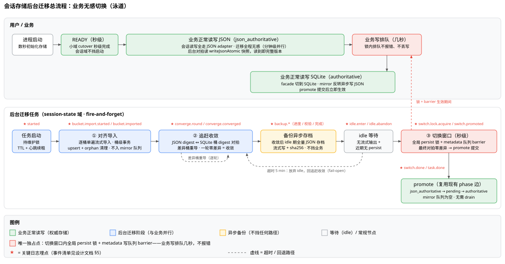

# 会话存储后台迁移设计（业务无感切换）

> 状态：**已实施（待真实大库验证）**——2026-08-19 feature 1-5 代码与测试落地、feature 6 文档同步完成；实施偏差见 §11，真实大库性能回填待办见 §10.3。
> 最后更新：2026-08-19（实施同步）。
> 前置阅读：`session-storage-current-architecture.zh-CN.md`（当前事实源）、`session-sqlite-migration-design-review.zh-CN.md`（设计评审报告）。
> 范围：会话域（session-state）的 JSON→SQLite cutover **后台化**。scheduled-task-runs / share / lan-access 三域不后台化（见 §8）。

## 1. 背景与目标

### 1.1 用户诉求

现状（P1 启动维护窗口，实施前）：HTTP listen 后，会话域 cutover 在维护窗口内同步执行，窗口内非白名单 `/api/*` 一律 503，前端展示迁移进度页（`MigrationProgressView`）。大库（约 1.4GB JSON）下窗口持续 1~2 分钟。用户诉求两条：

1. **迁移后台化、用户无感**：启动数秒内 READY，业务照常读写 JSON，迁移在后台并行推进，最终切换只允许秒级排队；
2. **备份不挡启动**：1.4GB 的全量备份写不再位于业务可用之前的启动关键路径上。

### 1.2 现状维护窗口的成本来源

| 阶段 | 内容 | 大库量级 | 为何挡业务 |
|---|---|---|---|
| 双读校验 | JSON 快照逐桶读取 + digest 汇总 | 秒~十秒级 | 维护窗口内串行第一步 |
| 备份写 | 全量 JSON 存档到 `storage/backups/`（流式写 + sha256 校验） | ~1.4GB 读写，数十秒 | cutover 前置条件，必须完成后才能导入 |
| 导入 | `replaceAllStream` 流式扫描导入 SQLite（单事务） | 分钟级 | 备份后串行执行，事务内含 phase 写入 |
| drain | 首次 mirror 队列物化，重写全部会话 JSON 文件 | 分钟级 | promote 前必须排空（pending → authoritative） |
| promote | phase 提交 + WAL checkpoint | 秒级 | 前序全部完成才执行 |

整体耗时 = 上述串行总和（1~2 分钟），期间业务 API 持续 503。根本问题：**把"一次性数据搬运"放进了启动关键路径**，而其中除最后的原子切换外，没有任何一步真正要求独占业务写入。

### 1.3 目标 / 非目标

目标：

- 启动 → READY 秒级完成（会话域退出维护窗口）；
- 迁移全程业务可用、无感（仅切换窗口内写排队几秒，不报错、不丢写）；
- 任意时刻崩溃均可幂等重来，权威数据零丢失；
- 备份保留但异步化，不挡任何路径（§4）；
- 迁移全程关键日志可观测（§5）。

非目标：

- 不改变 SQLite schema（不加表、不加列、不加新持久 phase 值）；
- 不动 scheduled-task-runs / share / lan-access 三域的启动链（§8）；
- 不放开 multi-version dataDir 并发限制（维持现状）。

## 2. 现状约束与可行性事实

设计建立在三个已实证的现状事实上：

| # | 事实 | 依据 | 设计含义 |
|---|---|---|---|
| F1 | `writeJsonAtomic`（`server/storage.mjs`，tmp + rename）保证任何时刻读到的 JSON 都是**完整版本快照**，不存在半写文件 | 现有原子写实现；评审报告附录 A.2 已实证同款模式无坏文件窗口 | 后台对拍可以随时安全读 JSON，无需与业务写协商 |
| F2 | `json_authoritative` 相位下**业务完全不写 SQLite**（facade 返回 null，写路径全走注入的 JSON adapter） | 当前架构文档 §3/§4（facade 路由） | 后台导入事务与业务写**零冲突**，导入可以任意时长并行推进 |
| F3 | 域维护锁已存在：TTL 60s + fencing token + pid 检测 + 心跳续租 | `session_state_maintenance_lock`（当前架构文档 §2） | 多进程互斥免费获得：后台任务全程持锁运行即可 |

维护锁现状补充：cutover / backup import / downgrade 等维护操作本就全部在锁内执行。后台迁移任务同样全程持锁（心跳续租防过期），双进程场景下第二个进程抢锁失败则不启动迁移任务（语义见 §7）。

## 3. 设计总览



总体思路：**把"数据搬运"从切换里拆出来放后台慢慢做，把切换压缩到只剩一次原子提交**。三个机制如下。

### 3.1 机制一：后台对齐导入

- 逐桶（global / 各 project 的 metadata 桶 + 会话文件桶）单遍流式读 JSON 快照，导入 SQLite；
- **桶级事务**：每桶一个 `BEGIN IMMEDIATE` 事务，桶间失败互不影响，已提交的桶不重做（幂等可重入）；
- 桶内 upsert（按 `(scope, project_id, session_id)`）+ orphan 清理（删除 JSON 中已不存在的行）；
- **不 enqueue mirror**：此时 JSON 才是权威，SQLite 是"追赶者"，导入数据与 mirror outbox 语义无关；不入队可避免 outbox 膨胀和对 drain 的干扰。

依据 F1/F2：读的是完整版本快照；写的事务与业务零冲突，可长时间后台推进。

### 3.2 机制二：追赶收敛循环

对齐导入完成后进入收敛循环：

1. 计算当前 JSON 侧每桶 digest（流式读 + 现有 canonicalize 规则）；
2. 与 SQLite 侧桶 digest 对拍（同规则聚合）；
3. 差异桶重新导入（复用 3.1 的桶级事务原语）；
4. 重复 1~3，直到**某一轮零差异**——收敛达成。

业务写持续发生时，循环追赶的是"最近某时刻的快照 + 写入延迟"；只要业务写入速率有限（对话场景天然如此），差异桶数会收敛到 0。收敛永远不阻塞业务——它只是后台循环。

### 3.3 机制三：秒级切换窗口

收敛达成后等待 **idle 信号**：无流式输出（无活跃 agent 事件流）且近期无 persist（如最近 N 秒无 JSON 写）。等待上限 5 分钟，超时则放弃本轮 idle、回到追赶收敛（fail-open，绝不强行切换）。

idle 信号满足后进入切换窗口：

1. 获取**全局 persist 锁**（现有会话持久化的串行点）；
2. 对 **metadata 写队列加 barrier**（§9 feature 3：排空在途写后阻塞新写入队，可显式释放）；
3. 在锁 + barrier 保护下做**最终对拍**（JSON digest vs SQLite digest）；
4. 零差异 → 复用现有 promote 提交路径：phase `json_authoritative → sqlite_authoritative_json_pending`（后台导入从未入 mirror 队列，队列必为空，无需 drain）→ `authoritative`；
5. 释放 barrier 与锁。

窗口内业务写**排队不报错**（锁等待语义），预期数秒；若最终对拍仍有差异超预算（说明 barrier 前有漏网写入），释放锁回追赶收敛，业务零感知。

### 3.4 全流程时序描述

1. **t0**：进程启动，listen 前仅 `ensureStorage()` + `initializeSqliteStorage()`（现状不变）；
2. **t0 + 数秒**：READY——三小域秒级 cutover 完成；会话域**不再进入维护窗口**，业务照常读写 JSON；
3. **t0 + 数秒 ~ 分钟级**：后台任务持维护锁执行对齐导入（业务全程无感）；
4. **分钟级**：追赶收敛循环，直至某轮零差异；
5. **收敛后 idle 等待期**：后台**异步执行全量 JSON 备份**（§4，与 idle 等待并行，不挡任何路径）；
6. **idle 信号到达**：进入切换窗口；
7. **秒级**：全局锁 + 队列 barrier → 最终对拍零差异 → promote → 释放；
8. **之后**：业务读写 SQLite（authoritative），mirror 反转为异步写 JSON（现有 drain 机制接管）。

## 4. 备份策略（异步化）

用户确认：**备份不砍，改为后台异步**。现状把 ~1.4GB 备份写放在导入之前的同步路径上，是维护窗口的主要成本之一；新设计把备份移出一切关键路径。

| 项 | 设计 |
|---|---|
| 何时做 | 收敛达成之后、promote 之前的 **idle 等待期**（此时 JSON 内容已收敛稳定，备份即"切换前最终快照"语义）；与 idle 等待并行执行 |
| 写哪里 | `storage/backups/`，沿用现有命名与登记规则（`session_storage_state.backup_file`） |
| 怎么写 | 流式写（内存有界）；**不持全局 persist 锁、不进 metadata 写队列**——备份是纯读 JSON 快照 + 顺序写文件，不挡任何读写路径 |
| 如何校验 | 沿用现有三段式：写 `.tmp` → 流式重读校验 sha256 / 字节数 / 首尾字节 → rename；全部成功才登记（评审 A.2 已实证不存在"登记坏备份"的崩溃窗口） |
| 失败语义 | 写失败或校验失败：删除 `.tmp`，回到 idle 等待重试（有界重试次数）；**不阻断切换**——切换的最终一致性由窗口内最终对拍保证，备份是快照存档而非切换前置条件 |
| 与切换的关系 | 不要求备份完成才能切换：若 idle 信号先到而备份未完成，切换窗口照常执行（promote 不改 JSON 文件，备份对象是收敛后的稳定快照，不受切换影响） |

## 5. 关键日志设计

迁移全程（任务启动 → promote / 失败）记录关键日志。**遵循现有 cutover 模块的 `options.logger` 注入模式**（`options.logger || logger`，见 `server/session-state-cutover.mjs`），不引全局 logger，测试可注入捕获断言。

### 5.1 日志级别划分原则

| 级别 | 语义 | 例子 |
|---|---|---|
| info | 里程碑：状态跃迁、阶段完成、关键耗时 | 收敛达成、promote 完成 |
| warn | 可恢复异常：自动重试 / 回退路径被触发 | idle 超时回追赶、备份重试、切换对拍差异回退 |
| error | 任务失败：后台迁移整体终止（保持 `json_authoritative`） | 导入不可恢复错误、重试耗尽 |

### 5.2 日志事件清单

事件名统一前缀 `session.background_migration.*`；全程携带 `taskId`（本次任务实例 id：时间戳 + pid）。

| 事件 | 级别 | 关键字段 | 触发时机 |
|---|---|---|---|
| `started` | info | taskId、phase（应为 `json_authoritative`）、bucketTotal（桶总数）、lockFencing | 任务启动、维护锁获取成功后 |
| `bucket.import.started` | info | taskId、bucket（桶名）、fileCount（预估会话数） | 每桶导入事务开启 |
| `bucket.imported` | info | taskId、bucket、sessions（导入会话数）、bytes、durationMs | 每桶导入事务提交 |
| `bucket.import.failed` | warn | taskId、bucket、error、attempt | 桶导入失败（重试；下轮收敛兜底） |
| `converge.round` | info | taskId、round（轮次号）、diffBuckets（差异桶数）、diffList（差异桶清单） | 每轮对拍完成 |
| `converge.converged` | info | taskId、round、durationMs | 某轮零差异，收敛达成 |
| `backup.started` | info | taskId、targetPath | idle 期备份开始 |
| `backup.bucket.progress` | info | taskId、bucket、sessions、bytes | 备份每桶完成（**桶级采样**，桶内不逐文件刷屏） |
| `backup.verify` | info | taskId、sha256、bytes | 流式重读校验通过 |
| `backup.done` | info | taskId、path、bytes、durationMs | rename 完成 |
| `backup.retried` | warn | taskId、attempt、error | 备份失败重试 |
| `idle.enter` | info | taskId | 进入 idle 等待 |
| `idle.signal` | info | taskId、reason（no-stream + no-persist）、waitedMs | idle 信号满足，准备进入切换窗口 |
| `idle.abandon` | warn | taskId、timeoutMs、elapsedMs | 5 分钟超时放弃，回追赶收敛 |
| `switch.lock.acquire` | info | taskId、waitMs（锁等待时长） | 全局 persist 锁 + metadata 队列 barrier 就绪 |
| `switch.verify` | info | taskId、diffBuckets（最终对拍结果，应为 0）、durationMs | 窗口内最终对拍 |
| `switch.verify.retry` | warn | taskId、diffBuckets、diffList | 对拍差异超预算，释放锁回追赶 |
| `switch.promoted` | info | taskId、lockHeldMs、barrierHeldMs | promote 事务提交，phase 切换完成 |
| `switch.done` | info | taskId、totalDurationMs（切换窗口总耗时） | 锁与 barrier 释放完毕 |
| `task.done` | info | taskId、totalDurationMs（任务全程耗时，含收敛轮次与 idle 等待） | promote 完成且锁释放后，任务正常终结 |
| `task.failed` | error | taskId、stage、error、attempts | 整体失败：终止任务，保持 `json_authoritative` |
| `task.aborted` | warn | taskId、reason（如锁丢失 / 进程冲突） | 非错误性终止 |

采样原则：桶内逐文件粒度不落日志（细粒度进度经 `/api/migration-status` 暴露，见 §6）；备份按桶一条；追赶按轮一条（差异桶清单通常为个位数，全量列出）。

实施补充（2026-08-19）：实际实现在此清单外额外记录四个事件——`skipped`（info，phase 不满足时任务跳过）、`bucket.pruned`（info，桶从 JSON 树消失、SQLite 侧清行）、`backup.abandoned`（warn，备份就绪时库已离开 `json_authoritative`，放弃登记）、`phase.reset`（warn，`cutover_running` 残留在锁内复位）；`backup.verify` 事件字段为 `path`/`bytes`、不带 sha256（见 §11）。

## 6. 状态机与 API

### 6.1 不加新持久态

phase 状态机的持久值集合不变：`json_authoritative → sqlite_authoritative_json_pending → authoritative`。理由：

- 后台导入 / 收敛阶段 SQLite 只是"追赶者"，不是权威——任意时刻崩溃，JSON 仍是完整权威，重启后任务幂等重来，**无需任何中间持久态记录进度**（桶级幂等天然可重入）；
- 切换复用现有 promote 事务路径与语义（含校验、WAL checkpoint），不新增一条未经实战的 phase 边；
- `cutover_running` 保留 schema（不做迁移删除），但新链路不再进入该状态——它属于旧同步 cutover 的事务窗口语义；存量残留值的处理见 §10。

### 6.2 进度暴露：`/api/migration-status` 新增 background 域

```json
{
  "sessionState": {
    "phase": "json_authoritative",
    "background": {
      "taskId": "1755590000000-12345",
      "state": "idle-waiting",
      "startedAt": "…",
      "buckets": { "total": 12, "imported": 12 },
      "convergeRound": 3,
      "diffBuckets": 0,
      "backup": { "state": "running", "path": null, "bytes": 0, "attempts": 1 },
      "lastEventAt": "…",
      "reason": null,
      "failure": null
    }
  }
}
```

`background.state`：`importing / converging / idle-waiting / switching / done / failed / aborted`——**内存态，随进程存活，不持久化**（`converging` 曾在首版实现中缺失，feature 5 集成测试发现后已修复，见 §11 偏差 6）；`done / failed / aborted` 为终态，供前端与诊断消费——`failed` 携带 `failure:{stage,error}`，`aborted` 携带 `reason`（`lock-busy` 时附锁 owner 诊断 `lockOwner`/`lockOwnerPid`/`lockFencing`，见 §10.2）。任务启动前该域整体缺省（`startup-state.mjs` 不输出 `background` 键）。该域与 phase 字段正交：phase 仍只由权威事务维护。

### 6.3 切换复用现有 phase 边

窗口内 promote 在一个事务内完成 `json_authoritative → sqlite_authoritative_json_pending`；由于后台导入**从未 enqueue mirror**，队列必为空，随即在同窗口内完成 `pending → authoritative`，无需 drain。崩溃在 promote 前：JSON 权威无损，重启重跑整个后台任务；崩溃在 promote 后：落入现有 pending / authoritative 恢复语义（现状已处理：完整性自检 + drain + promote）。

## 7. 并发与失败语义

| 场景 | 行为 | 结果 |
|---|---|---|
| 导入 / 收敛中进程崩溃 | 已导入桶随各自桶级事务提交或回滚；JSON 仍是完整权威 | 保持 `json_authoritative`；重启后任务幂等重来（桶级 upsert，不重复、不遗漏） |
| 收敛期间业务持续写入 | 差异桶在下一轮重导 | 循环继续，永不阻塞业务；写入速率有限则终将收敛 |
| idle 等待超时（5 min） | 放弃 idle，回追赶收敛 | fail-open：宁可多跑一轮，不强切 |
| 切换窗口最终对拍有差异 | 释放锁 + barrier，回追赶收敛 | 业务只经历几秒排队，零报错、零丢失 |
| promote 后 SQLite 损坏 | JSON 文件即"promote 前最新快照"（mirror 反转刚开始或尚未开始）+ 常规备份兜底 | 走现有权威完整性失败恢复路径（fail-closed → 备份 / 降级工具） |
| 双进程同时启动 | 维护锁互斥：第二进程抢锁失败（pid 检测 + fencing） | 第二进程不启动迁移任务，正常运行业务（JSON 路径）；细化项见 §10 |
| 备份失败 | 删 `.tmp`、有界重试、不阻断切换 | 切换一致性由最终对拍保证，与备份解耦 |
| 迁移任务整体失败 | 记 `task.failed`，保持 `json_authoritative` | 业务不受影响；诊断信息在 background 域 + 日志 |

## 8. 各域处理

| 域 | 处理 | 理由 |
|---|---|---|
| session-state | 本设计：后台迁移 + 秒级切换 | 库大（GB 级）、旧 cutover 分钟级、用户痛点所在 |
| scheduled-task-runs | 保留启动链现状（同步 cutover） | 单文件、低频写入，cutover 秒级完成；后台化的编排复杂度不抵收益 |
| share | 保留启动链现状 | 同上 |
| lan-access | 保留启动链现状 | 同上 |

三小域维持现有维护窗口参与方式；它们本身秒级完成，会话域退出维护窗口后，整体启动窗口即收缩到秒级。

## 9. 实施拆分（6 个 feature）

| # | feature | 内容 | 验收要点 | 状态 |
|---|---|---|---|---|
| 1 | `repository.alignBucketStream` 桶级导入原语 | 单桶流式读 JSON → 桶级事务 upsert + orphan 清理；不 enqueue mirror | 同桶重跑零差异（幂等）；桶事务边界正确；大桶内存有界 | ✅ 完成（另含 `deleteBucketRows`/`promoteAlignedSessionState`/`listBucketKeys`） |
| 2 | `session-state-background-migration.mjs` 编排模块 | 三机制状态机（importing → converging → idle-waiting → switching）、维护锁持有与心跳、`options.logger` 注入 | 全部状态跃迁有日志（对照 §5.2）；任意点崩溃重启可收敛；对拍差异回退路径正确 | ✅ 完成 |
| 3 | metadata 写队列 barrier API | 队列屏障：排空在途写 + 阻塞新写入队，支持显式释放 | barrier 期间业务写排队不报错；释放后按序补写不丢 | ✅ 完成（`acquireSessionJsonWriteBarrier` + `readLastSessionWriteFinishedAt`） |
| 4 | 启动链替换 + migration-status 扩展 + 备份异步化 | 会话域退出维护窗口；`background` 域暴露；备份移入 idle 期异步执行 | 大库启动 → READY 秒级；进度可见；备份失败不影响切换 | ✅ 完成（`resolveSessionStateStartupRoute` 路由 + `sessionState.background` 域） |
| 5 | 测试矩阵 | 并发写下的收敛、窗口排队语义、各阶段崩溃恢复、双进程互斥、备份失败重试 | 全绿；含慢盘 / 大库模拟下的内存上界断言 | ✅ 完成（`tests/server/session-state-background-migration.test.mjs` 等） |
| 6 | 文档同步 | 当前架构文档 §6 启动链改写、本文档状态更新、恢复 runbook 补充 | 文档与实现一致；旧同步 cutover 叙述标注过时 | ✅ 完成（2026-08-19：单一事实源 / 本文档 / runbook / wiki 同步） |

## 10. 开放风险与后续清理

1. **`cutover_running` 清退**（✅ 已落地）：schema 保留、新链路不再写入；存量残留由后台任务在取得维护锁后复位回 `json_authoritative`（`resetCutoverRunningResidue`，已登记的 `backup_file` 原样保留，日志 `session.background_migration.phase.reset`），已补测试。
2. **双进程下第二进程行为细化**（✅ 已落地）：第二进程抢锁失败（50ms 快速失败预检 + 维护锁包装层兜底）后任务以 `aborted(reason:'lock-busy')` 终止，`/api/migration-status` 的 `background` 快照携带 `lockOwner`/`lockOwnerPid`/`lockFencing`，可显示"另一进程迁移中"而非空白；迁移中锁丢失为 `aborted(reason:'lock-lost')`。
3. **真实大库性能验证待办**（未决——本文状态"待真实大库验证"即指此）：收敛轮次耗时、切换窗口实测时长（锁等待 + 对拍 + promote）、备份与 idle 并行的磁盘竞争，均需在 ~1.4GB 真实库上实测后回填本文档。
4. **（低）极端持续写入下长时间不收敛**（未决）：5 分钟 idle 超时回追赶的循环上限与告警阈值，待实测数据后定。

## 11. 实施偏差记录（2026-08-19）

feature 1-5 实施与本文设计的偏差，均已在代码与测试中固化（本节为事实记录，设计正文保留原貌）：

1. **promote 走 repository 内部 `updateStorageState`**：§3.3 的"复用现有 promote 提交路径"落地为 `session-state-repository.mjs` 新增的 `promoteAlignedSessionState`——`json_authoritative → sqlite_authoritative_json_pending → authoritative` 在同一个 `BEGIN IMMEDIATE` 事务内完成（前置 quickCheck / count / 空 mirror 队列校验，提交后 best-effort WAL checkpoint）。phase 字面量在 repository 内内联，避免 repository→service 的模块循环依赖；promote 返回后由任务调用 `readSessionStorageState()` 刷新 service 相位缓存，下一次读写立即路由 SQLite。
2. **写队列 barrier 的 park 从 drain 完成后生效**：`acquireSessionJsonWriteBarrier` 先观察 `sessions` 与 `sessions-metadata` 两条会话域写队列的队尾直至稳定（drain），随后才关门——barrier 持有期间新入队的会话域写 park（FIFO 保序、不执行、不报错），release 后按序补写；drain 期间链式追加的写按序完成而非被 park（park 它们会死锁 drain）。锁序契约：先全局 persist 锁、后 barrier。
3. **`backup.verify` 日志无 sha256 字段**：备份写入流本身已同步累计 sha256 / 字节数并分块重读校验（写侧完成，坏备份不会登记）；verify 事件只携带 `path`/`bytes`，避免为一条日志对 1.4GB 文件做双倍读盘。
4. **"写时间戳未变则跳过重读"优化未实现**：收敛轮每轮完整重读 JSON 侧做 digest 对拍（`readLastSessionWriteFinishedAt` 仅用于 idle 信号判定），正确性优先——"最近无写完成"不能证明文件内容与内存 digest 映射一致。
5. **cutover 模块的 `cutover_running` 恢复分支保留**：新启动链不再把任何库送入 `initializeSessionStateCutover` 的该分支（json_authoritative/cutover_running 均路由后台任务，残留由任务复位），但离线/维护工具仍可直调 cutover 模块，其"cutover_running → json_authoritative 重跑"语义原样保留。
6. ~~**`background.state` 无 `converging` 值**~~（已修复）：集成测试（feature 5）发现收敛轮曾停留在 `importing` 状态内推进，与 §6.2 设计不符；已补 `setState('converging')`（switch 重试回收敛同样生效），状态值集合为 `importing / converging / idle-waiting / switching / done / failed / aborted`。
7. **备份复用已登记 `backup_file`**：idle 期备份先按当前 summary 复验已登记备份（`verifyRegisteredCutoverBackup`），通过则直接复用不重写；备份登记会等待进行中的切换窗口结束后再写 phase，若届时库已离开 `json_authoritative`（切换已成功）则放弃登记（`backup.abandoned`）。
