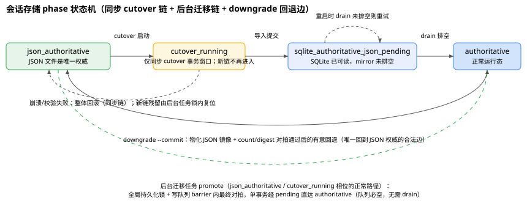

# 会话存储当前架构（单一事实文档）

> 基准：F9（Phase 2 核心存储层 + Phase 3 接线）完成态 + 会话域后台迁移（feature 1-5）已实施，最后更新 2026-08-19；SQLite schema v9（会话域表为 migration v6/v7）。
> 定位：本文档是会话（conversation / session state）存储的**当前事实源**。`sqlite-compatibility-spike.zh-CN.md`（F1）、`sqlite-storage-foundation.zh-CN.md`（F2）、`session-index-foundation.zh-CN.md`（F6）、`session-index-query-migration.zh-CN.md`（F7）、`session-state-transactional-storage.zh-CN.md`（F8/F9）保留为**历史决策记录**——设计动机、取舍与过程数据以原文为准；凡旧文与本文冲突的叙述（如启动链执行时机），以本文为准。
> 评审背景：`session-sqlite-migration-design-review.zh-CN.md`（设计评审报告，含缺陷清单与改进建议）。

## 1. 存储布局

- **权威**：`storage/quickforge.sqlite3`（WAL 模式，运行时为 `quickforge.sqlite3` / `-wal` / `-shm` 三件套）。会话数据存于 `session_states`（body + metadata）、`session_messages`（拆分会话的增量消息行）、`session_state_tombstones`（删除墓碑）；`session_index` 为派生查询索引，与权威同事务维护。
- **镜像**：JSON 文件保持原有布局（`storage/conversations/global/sessions/<sessionId>.json` + `sessions-metadata.json`，project 对应 `storage/conversations/projects/<projectId>/…`），由 mirror outbox + drain 物化。JSON mirror 是**一等永久设施**（降级路径 + 外部工具读取 + 旧版兼容），不是过渡设施；其双写成本为已接受的永久税，决策与退役条件见 F8 文档 §4.1。
- **控制面**：phase 状态机 singleton `session_storage_state`；mirror 队列 `session_json_mirror_queue`；维护锁 `session_state_maintenance_lock`；恢复计划文件 `storage/session-state-restore-plan.json`；备份文件写入 `storage/backups/`。

## 2. 表结构概览

会话域表由 migration v6（`session_state_transactional_storage`）与 v7（`session_messages_incremental_storage`）创建。当前库总 schema 为 v9（v8 为 share 域、v9 为 lan-access 域，各自独立）。

| 表 | 来源 | 作用 |
|---|---|---|
| `session_states` | v6 | 复合主键 `(scope, project_id, session_id)`；`state_json`/`state_digest`、`metadata_json`/`metadata_digest`、`revision`（单调递增 CAS 版本）、`state_version`（业务版本）、`created_at`/`updated_at` |
| `session_state_tombstones` | v6 | 删除墓碑，阻止 stale writer 在删除后以旧 revision 复活会话 |
| `session_storage_state` | v6 | singleton phase 状态机；记录 `state_count`、canonical `digest`、`backup_file`、`diagnostic_json` |
| `session_json_mirror_queue` | v6 | JSON mirror outbox，按 `(scope, project_id, session_id)` 去重，记录 upsert/delete、revision、attempts、last_error |
| `session_state_maintenance_lock` | v6 | singleton 维护锁，owner PID + fencing + heartbeat/expires |
| `session_messages` | v7 | 拆分会话的增量消息表；复合主键 `(scope, project_id, session_id, seq)`，`UNIQUE(scope, project_id, session_id, message_id)`（message_id 可空）；每行含 `message_json`、`message_digest`、`created`/`updated` |
| `session_index` | v4/v5 | 派生查询索引（F6/F7）；与 `session_states` 在同一事务维护，可从权威重建 |

关键不变量：body/metadata 提交、messages 行写入、`session_index` upsert、mirror 入队在**同一个 immediate 事务**内完成，要么全部成功要么全部回滚。

## 3. Phase 状态机（完整图）



```text
同步 cutover 链（pending/authoritative 恢复与维护工具直调；新启动链正常不再进入）：
json_authoritative -> cutover_running -> sqlite_authoritative_json_pending -> authoritative
   ^    ^                 |                            |    ^                     |
   |    |                 +-- 崩溃/校验失败：整体回滚    +----+ 重启时重试 drain     |
   |    |                     重启重跑 cutover                                     |
   +----+----------------------------- downgrade --commit ------------------------+
        （唯一回到 JSON 权威的合法边：物化镜像 + count/digest 对拍通过后的有意回退）
```

后台迁移链（json_authoritative / cutover_running 时的正常路径，2026-08-19 起）：

```text
json_authoritative --（后台任务 promote：全局 persist 锁 + 写队列 barrier 内单事务，
                      经 pending 瞬时中间写直达 authoritative；队列必空，无需 drain）--> authoritative
cutover_running（存量残留）--（后台任务取得维护锁后复位）--> json_authoritative
```

- `json_authoritative`：JSON 文件是唯一权威；service 全部走注入的 JSON adapter。此相位下启动链把迁移交给后台任务（见 §6），业务照常读写 JSON、不受迁移影响。
- `cutover_running`：仅存在于同步 cutover 事务窗口；崩溃后下次启动回到 `json_authoritative` 重新 cutover（导入整体回滚，不会重复导入或半状态）。**新启动链不再进入该状态**——json_authoritative/cutover_running 一律路由到后台迁移任务，存量 `cutover_running` 残留由任务在维护锁内复位回 `json_authoritative`（日志 `session.background_migration.phase.reset`，已登记的 `backup_file` 原样保留）；cutover 模块自身的该恢复分支保留，供维护工具直调。
- `sqlite_authoritative_json_pending`：SQLite 已提交、JSON mirror 尚未排空；此 phase 下 SQLite 已可读（`isSessionStateAuthoritative()` 为 true）；重启时先完整性自检再重试 drain，排空后 promote。后台迁移链下该值仅作为 promote 单事务内的瞬时中间写，不会以该值持久残留。
- `authoritative`：mirror 排空完成，正常运行态。
- `downgrade --commit`（离线工具，见 §7）是图中唯一的有意回退边：drain 物化全部镜像、count/digest 对拍通过后把 phase 置回 `json_authoritative`，之后写入直连 JSON。

规则：pending/authoritative 只走 SQLite，**绝不回 JSON 权威**；`json_authoritative`/`cutover_running` 只走 JSON adapter。权威完整性（`quick_check` + 轻量对账）失败时先尝试从权威 `session_states` 重建 `session_index`，复验仍失败则 fail closed。启动 `quick_check` 有检查税优化（进程内去重 + 7 天 marker 降频，见 `sqlite-storage-foundation.zh-CN.md` §6）：四域共用一个库文件时每次启动至多真扫一次，轻量 SQL 对账不受影响；手动维护端点始终真扫。

## 4. 写路径（CAS + outbox + drain）

单次 save 的实际链路：

1. service 按拆分策略生成写计划（inline / body-only / append / replace，阈值 200 条）；
2. repository 在一个 `BEGIN IMMEDIATE` 事务内完成：revision/stateVersion CAS 检查 → body/messages 行写入 → `session_index` upsert → mirror outbox 入队；冲突返回 HTTP 409 `SESSION_STATE_CONFLICT`；
3. 提交后 best-effort drain：按 8 条分页拉取 outbox，upsert 物化 body 文件 + metadata 桶条目，delete 物化删除对应 JSON；拆分会话 drain 前从 `session_messages` 重组完整 body——JSON 文件始终是完整可降级形态；
4. drain 失败保留队列并 1 秒定时重试（失败条目 `updated_at` 后移、整批零确认即停止本轮防死循环）；mirror 失败不传播业务提交失败。

写放大：单次 save ≈ `state_json` + outbox 行（又一份完整 state_json）+ 索引行 + WAL + 之后的 JSON 物化，约为纯 JSON 方案的 3~4 倍写量（链路详见评审报告 §2 图）。这是为降级能力支付的**永久**税。

## 5. 读路径（split 重组与增量端点）

- **整体读**：未拆分会话直接返回 body；拆分会话由 service 重组 `body + messages`（`readSessionStateValue` / `readSessionStateStore('sessions')` / `exportSnapshot`），调用方不感知拆分。
- **增量端点**：`GET /api/agents/:sessionId/messages?after=N&limit=…`（默认 500，上限 5000），返回 `{ after, count, hasMore, messages }`；`count < after` 表示服务端已截断，客户端全量重取。
- **轻量 state 帧**：拆分会话的 `GET /api/agents/:id/state`、`POST /restore`、SSE 初始 `state` 帧与增量事件帧携带 `messagesSummary: { count }` 与增量尾部（`messagesAfter`/`messagesIncremental`），不再携带全量 messages；`stateVersion` 语义严格不变。
- **列表查询**：F7 的 SQL 索引路径仍是首选；不满足 eligibility 或索引 degraded 时走 fallback——权威态下 fallback 经 facade 读 SQLite `exportSnapshot()`（权威新数据，不读物理 JSON），详见 F7 文档"F8 之后的定位"一节。

## 6. 启动链现状

> 注意：F8 文档最初叙述的"HTTP listen 之前执行 cutover 链"已过时；其后"会话域同步 cutover 位于启动维护窗口"的状态也已被后台迁移取代（设计与实施偏差记录见 `session-storage-background-migration-design.zh-CN.md`）。现状（2026-08-19）如下。

- **listen 前**只做 `ensureStorage()` + `initializeSqliteStorage()`——维护门与 `/api/migration-status` 依赖数据库句柄。
- **HTTP listen 后**，其余启动链在后台维护窗口中 fire-and-forget 执行。**会话域按 phase 路由**（`resolveSessionStateStartupRoute`，`server/session-state-background-migration.mjs`）：
  - `json_authoritative` / `cutover_running` → **后台迁移**：同步链只做 `initializeSessionStateService()` → `recoverSessionStateRestorePlan()` → `drainSessionJsonMirror()`（该相位下为空队列确认），随后 fire-and-forget 启动后台迁移任务（`startSessionStateBackgroundMigration`）——**不挡 READY**，业务照常读写 JSON；`cutover_running` 残留在任务取得维护锁后复位回 `json_authoritative`；
  - `pending` / `authoritative`（及未知 phase，作为 fail-closed 兜底）→ 保留同步链：`initializeSessionStateCutover()`（完整性自检 + drain + promote 恢复语义）→ `initializeSessionStateService()` → `recoverSessionStateRestorePlan()` → `drainSessionJsonMirror()`。
- **维护窗口现状**：会话域已退出维护窗口，窗口内只剩 scheduled-task-runs / share / lan-access 三小域的同构 cutover 链与 session index 初始化等，秒级完成。窗口机制不变（`server/startup-state.mjs`）：进程级状态 `migrating`/`ready`/`failed`；窗口内非白名单 `/api/*` 一律 503，白名单仅 `GET /api/health` 与 `GET /api/migration-status`；迁移进度页（`MigrationProgressView`）仅在三小域切换的短暂窗口可见、可能不再出现；会话域后台迁移进度经 migration-status 的 `sessionState.background` 域暴露（内存态快照，READY 后仍可轮询，字段见设计文档 §6.2）。
- **fail-closed 语义**：权威完整性校验失败不再终止进程，而是置 `failed`——`/api/health` 返回 `ok:false` 与 `startupError`，业务 API 持续 503，等待人工介入（修复数据/重启/离线工具）。后台迁移任务自身的失败**不**触发 fail-closed：phase 保持 `json_authoritative`，业务不受影响，重启即整任务幂等重试（见恢复 runbook「后台迁移失败」）。
- **shutdown**：`stopSessionStateService()` 清理 mirror 定时器后关闭 SQLite。

## 7. 备份 / 恢复 / 降级工具清单

| 入口 | 作用 |
|---|---|
| `GET /api/backup/export?scope=sessions`（及 `scope=all`、safety backup） | 权威模式下维护锁内 `quick_check` + 轻量 integrity + `exportSnapshot()`，拆分会话组装为完整 body 导出；integrity 失败 fail closed |
| `POST /api/backup/import`（含 conversations） | 维护锁内：before 快照 → target 归一化校验 → 写恢复计划 → 单事务 `replaceAll` → count/digest + integrity 验证；失败自动补偿，补偿失败保留 `compensation_failed` 计划待启动回滚；维护锁占用时返回 423 `session_state_maintenance` |
| `storage/session-state-restore-plan.json` | 恢复计划文件：启动时 `prepared/applying/target_applied` roll-forward、`compensating/compensation_failed` rollback；缺失或不符阻止启动 |
| `node server/maintenance/export-session-state-v1.mjs <输出.json>` | 离线导出（须停所有进程）：要求 phase 为 pending/authoritative，校验通过后写 v1 备份，tmp + 重读验证 + rename |
| `node server/maintenance/downgrade-session-state-v1.mjs [--dry-run] [--commit]` | 离线降级：`--dry-run` 只读报告；默认物化 JSON 镜像 + `buildSessionJsonSnapshot` 对拍（拆分会话按 assembled 表示 digest 对拍）；`--commit` 校验通过后切回 `json_authoritative` |

cutover 备份定位：同步 cutover 链中 v1 备份是导入前置条件（F8 文档）；**后台迁移模式下**备份在收敛达成后的 idle 等待期异步生成（流式写 + 分块重读校验；复验通过的已登记 `backup_file` 直接复用不重写），完成后登记 `session_storage_state.backup_file`——失败有界重试、不阻断切换，备份登记若撞上已完成的切换则放弃（详见后台迁移设计文档 §4 与 §11 偏差记录）。

彻底回到旧版（导出 → 移走 SQLite 三件套 → 启动旧版 → 导入 v1）的完整步骤见 F5 文档第 5 节。

## 8. 已知限制汇总

- **网络盘**：SQLite WAL 依赖本地文件锁与 mmap 语义，不支持网络文件系统；`QUICKFORGE_DATA_DIR` 必须放在本地盘。
- **WAL 三件套**：不得只复制/删除主库文件；迁移或降级必须整体处理 `-wal`/`-shm`。
- **最低 Node**：`node:sqlite` 需要 Node ≥ 22.19；旧 Node 打开新 schema 会拒绝启动而非降级写 JSON 造成 split-brain。
- **multi-version dataDir**：不支持多个 QuickForge 版本并发读写同一 dataDir；`user_version` 不匹配时新版本拒绝启动或按迁移规则处理。
- **JSON mirror 不是事务边界**：镜像为 best-effort，权威与一致性以 SQLite 为准。
- **digest 是"表示指纹"而非"内容指纹"**：同一逻辑会话拆分前后 digest 不同（拆分会话 body digest 不含 messages），外部不得把 digest 当内容指纹使用（F8 文档 §9.2 警示）。
- **同长度中部修改的增量检测盲区**：拆分会话按「行数 + 尾消息 digest」判定增量；同总数、同尾消息的中部原地修改不会被检测（不落库、无报错），需 `messages_replaced` 全量帧或显式全量刷新收敛；`verifyIntegrity` 可发现最终不一致。
- **split 阈值边界**：拆分一旦生效永不降回 inline；恰好 199 条每次全量 body 重写，201 条进入增量，阈值两侧成本曲线突变（设计选择）。
- **无 id 消息不去重**：仅带稳定 `message_id` 的消息受 UNIQUE 约束幂等；无 id 消息在客户端重试同一批 append 时可能产生重复行。
- **`synchronous` 已切换为 `FULL`（已定案）**：原 `synchronous=NORMAL` 断电窗口经实测后定案切换为 FULL（高频小事务均次增量约 0.46ms），见 `sqlite-storage-foundation.zh-CN.md` §3.1。
- **digest 持久化后不再定期重算**：启动链路全部为轻量校验（`quick_check` + SQL 对账），磁盘 bit-rot 或外部篡改只有手动跑离线全量校验才暴露（评审报告建议定期/手动触发逐行 digest 校验）。
- **持久化冲突耗尽静默放弃**：CAS 三次重试耗尽后仅 warn 并返回 null，消息可能未落库且前端无感知（评审报告 §3.2，待改进）。
